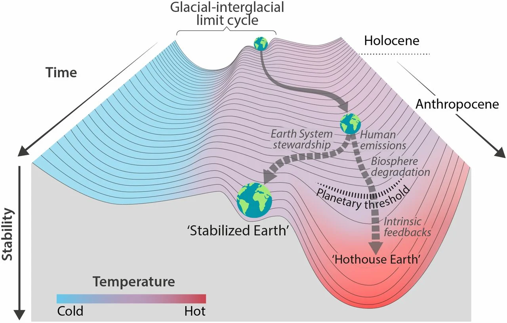
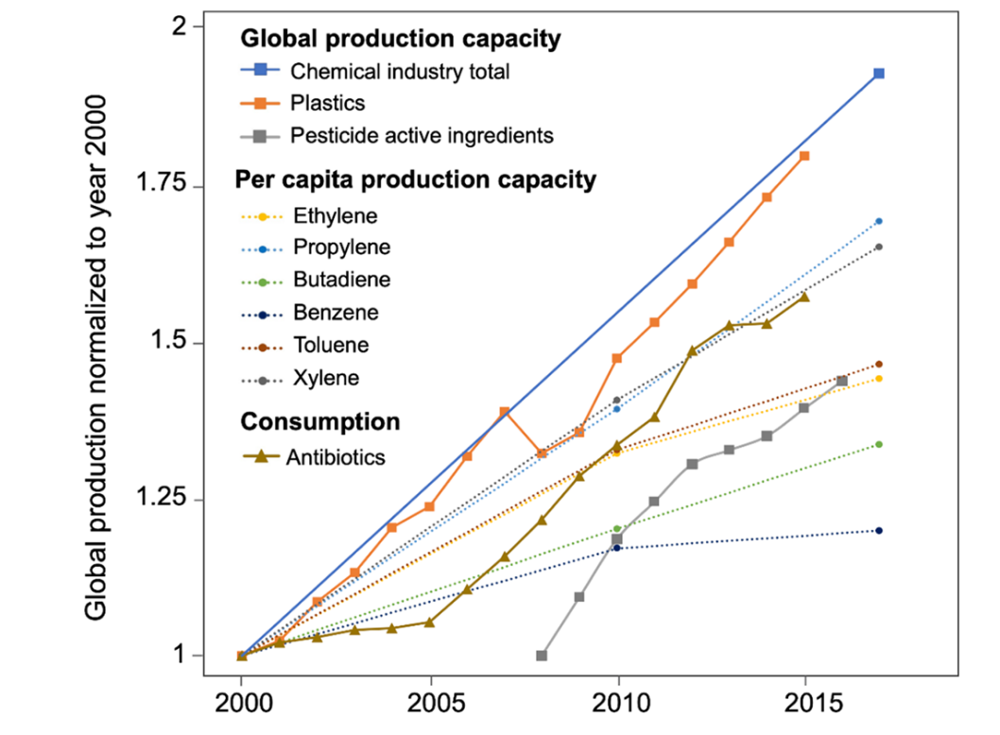
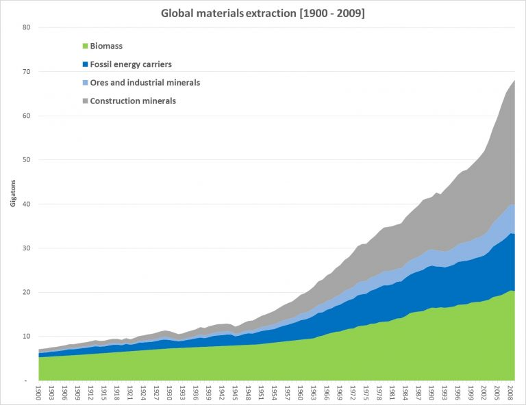
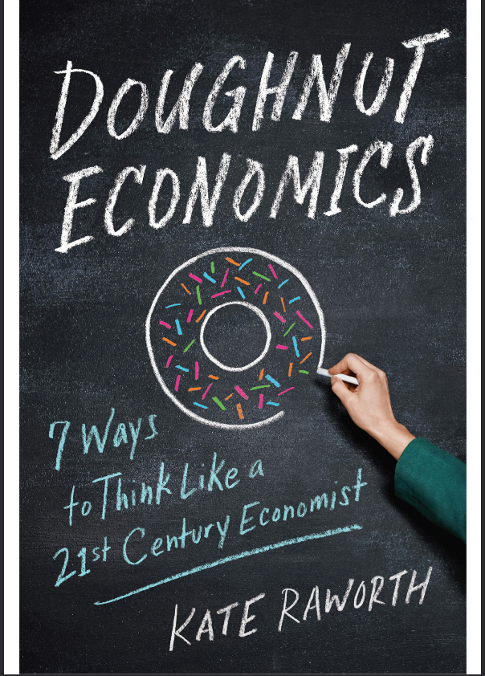
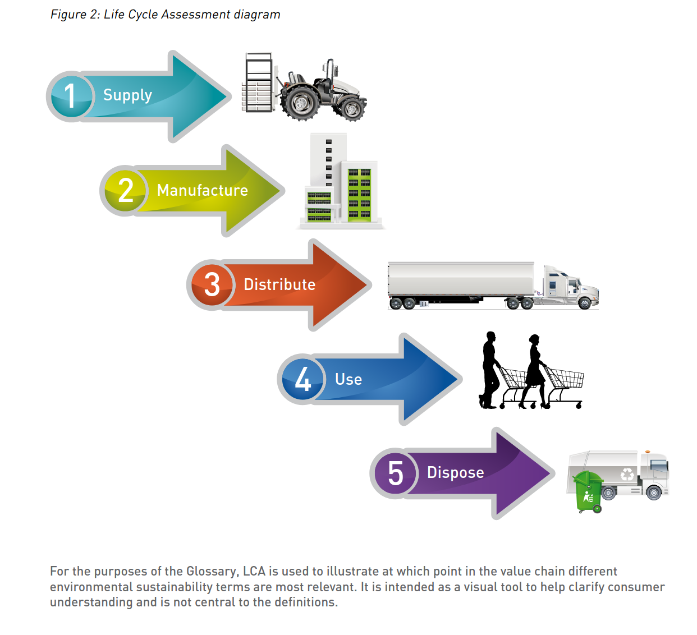

# Wirtschaftswachstum und ökologischer Zusammenbruch

## Die große Beschleunigung

::: notes

Das Jahr 1950 wird oft als Stichdatum für den Beginn eines neuen geologischen Zeitalters angesehen, nämlich des Anthropozän. Das Anthropozän ist deswegen ein geologisches Zeitalter, jedenfalls sagen dass diejenigen, die in die wissenschaftliche Geologie einführen wollen, weil in diesem Zeitalter der Mensch&mdash;man könnte auch sagen: die Menschheit&mdash; der entscheidende Faktor für die Gestalt der Erde bzw. der Erdoberfläche ist. Etwa 1950 setzt ein Prozess ein, den man in den Erdsystemwissenschaft als die *Große Beschleunigung* bezeichnet hat. In dem gleichnamigen Projekt wurden verschiedene Indikatoren für Wachstumsprozesse untersucht. Das Ergebnis. Seit 1950 haben sich der Ressourcenverbrauch der Menschheit und alle die Aktivitäten, die zu diesem Ressourcenverbrauch führen, sich gigantisch und zum Teil exponentiell gesteigert haben.

:::

—
## Planetary boundaries

 

—

## Johan Rockström

Johan Rockström:_ 10 years to transform the future of humanity -- or destabilize the planet | TED Talk — 

<https://www.ted.com/talks/johan_rockstrom_10_years_to_transform_the_future_of_humanity_or_destabilize_the_planet>

—
## Hothouse earth?

::: notes

Die große Beschleunigung hat schon bewirkt, dass Belastungsgrenzen des Erdsystems durchbrochen wurden. 

Nur wenn bestimmte Schwellenwerte nicht überschritten werden, ist die Erde dazu in der Lage, die Menschheit zu versorgen. Man spricht in den Erdsystemwissenschaften von einem *safe operating space* für die Menschheit. Dazu gehört vor allem die richtige Temperatur, deren Höhe vom Gehalt der Atmosphäre an Treibhausgasen abhängt. Vor allem die  Verbrennung von Kohle, Öl und Gas, aber auch die veränderte Landnutzung und das Bauen mit Zement haben den Gehalt der Atmosphäre an Treibhausgasen seit dem Beginn der industriellen Revolution schon um das Anderthalbfache gesteigert – zu über einem Drittel dieser Steigerung kam es in den letzten 30 Jahren, als der Zusammenhang von Erderhitzung und Treibhausgasen schon gut erforscht war. Bei einer Erhitzung der Oberfläche um mehr als 1,5° verlässt die Menschheit ihren *safe operating space*. Es gibt aber auch andere planetare Grenzen. Eine zweite sehr wichtige ist die Qualität der Biodiversität. In Verbindung mit ihr spielen auch z.b. der Eintrag von Phosphaten und von Stickstoff, der Süßwasserhaushalt und die Menge an Substanzen – von Antibiotika bis zu Mikroplastik – eine Rolle, die die Menschheit in die Biospäre einbringt. eine Gruppe von Erdsystem-Wissenschaftler:innen spricht von neun planetaren Grenzen. Mehrere davon sind bereits in einer Weise überschritten, die das Überleben der Menschheit – das kann man ohne Übertreibung sagen – zumindestens in Frage stellt und zu Millionen, wenn nicht zu Milliarden Todesopfern führen führen wird. 

:::

—

## 2022: Green water

@wang-erlandssonPlanetaryBoundaryGreen2022 

## 2022: Novel entities

@perssonOutsideSafeOperating2022 

## Planetary health&mdash;ecological grief

> The concept of planetary health is based on the understanding that human health and human civilisation depend on flourishing natural systems and the wise stewardship of those natural systems. However, natural systems are being degraded to an extent unprecedented in human history.

[Safeguarding human health in the Anthropocene epoch: report of The Rockefeller Foundation–Lancet Commission on planetary health](https://www.thelancet.com/journals/lancet/article/PIIS0140-6736\(15%2960901-1/fulltext "Safeguarding human health in the Anthropocene epoch: report of The Rockefeller Foundation–Lancet Commission on planetary health - The Lancet")

---

[Hope and mourning in the Anthropocene: Understanding ecological grief](https://theconversation.com/hope-and-mourning-in-the-anthropocene-understanding-ecological-grief-88630 "Hope and mourning in the Anthropocene: Understanding ecological grief")

[Climate change: 'We've created a civilisation hell bent on destroying itself – I'm terrified', writes Earth scientist](https://theconversation.com/climate-change-weve-created-a-civilisation-hell-bent-on-destroying-itself-im-terrified-writes-earth-scientist-113055 "Climate change: 'We've created a civilisation hell bent on destroying itself – I'm terrified', writes Earth scientist")

::: notes

Wer in unsere Wirtschaftsprozesse eingebunden ist und sich vielleicht wohlfühlt in seinen Funktionen für die Wachstums-Wirtschaft, in der wir alle leben, wohlfühlt, nimmt möglicherweise nicht wahr, wie sehr diese Wirtschaft uns als biologische Wesen auf der Erde bedroht. (Sie bedroht uns, weil wir von anderen Arten abhängen und damit, auch davon, dass ihre Ökosysteme funktionieren.) Vielen erscheinem die Äußerungen Greta Thunbergs, des UN_Gemeralsekretärs, des Papsts und des Dalai Lama als übertrieben oder hysterisch[^optimismus_hw]. Sie sind es nicht.

Viele reagieren aber trotzdem auf diese Prozesse mit Kummer und Trauer. Es setzt sich untergründig etwas durch, und das hängt vielleicht auch mit der Corona-Krise zusammen, in der wir uns befinden und wegen der wir uns jetzt ja nur online treffen, wie *grief*, wie Depression. Es gibt eine Unzufriedenheit mit dem Alltagsleben in dieser enorm beschleunigten Wachstums-Welt, das sich z.b. darin ausdrückt, das sehr sehr viele eigentlich ganz froh über den lockdown waren und diese Zeit eher&mdash;so zynisch es klingt&mdash;als erholsam erlebt haben. Diese Depression ist vielleicht bei Jugendlichen oft noch spürbarer als bei Erwachsenen, aber sie wird zu einem kulturellen Grundgefühle aus. 

Gerade in der Content-Strategie müssen wir davon ausgehen, dass die Nutzerinnen und Nutzer, an die wir uns wenden, immer mehr mit dieser Grundstimmung leben, dass sie die Verhältnisse, unter denen sie leben als ungesund empfinden und darauf reagieren. Wir merken das ja schon auf der Marketing-Ebene daran, wie plötzlich Nachhaltigkeit betont wird und wie plötzlich Dinge, die man vor einiger Zeit vielleicht noch als Öko-Spinnerei abgetan hätte in die Marketingstrategie von großen Firmen eingehen – wenn auch fast immer als *greenwashing*. Das was ich jetzt im folgenden sagen möchte, hängt auch mit diesem Grundgefühl der Trauer, des *grief*, der Vorstellung, dass etwas unrettbar verloren geht, zusammen. Diese Eindrücke sind schwer zu objektivieren, man könnte sie auch als Illusion abtun, aber sehr viel spricht dafür dass dieses Gefühl sich immer mehr durchsetzen wird und den Fortschrittsoptimismus in dem wir alle seit den 80er und 90er Jahren irgendwie befangen waren, ablösen wird.

:::

## Digitisation and resource consumption

https://www.sciencedirect.com/science/article/abs/pii/S0921800909002158?via%3Dihub "Growth in global materials use, GDP and population during the 20th century - ScienceDirect")

::: notes

Was haben wir als in der digitalen Welt Arbeitende mit diesem planetaren Grenzen zu tun? Wer in einem Wirtschaftsunternehmen oder in Verbindung mit der Wirtschaft arbeitet, ist in die großen Beschleunigung involviert ist: als Konsumentin oder Konsument privat und auch im Bereich unserer Arbeit, aber vor allem durch die Produktion von noch mehr Dienstleistungen und Gütern. Wir nehmen diese Verbindung aber oft nicht wirklich wahr. Wir beschäftigen uns mit Inhalten, mit Informationen. Ihr materieller Hintergrund wird nur selten sichtbar. Marketing, PR, Produktästhetik und viele Medien verbergen ihn sogar systematisch, so dass wir den Eindruck haben, wir beschäftigten uns mit sogenannten *immateriellen Gütern*. Das ist aber eine große Illusion.

Fast alles, was wir in der digitalen Wirtschaft tun, hat materielle Konsequenzen. Das beginnt damit, dass wir Strom verbrauchen, und zwar so viel Strom, dass die gesamte erneuerbare Energie der Erde nicht ausreicht um im Moment nur den Strom für das Internet zu produzieren. Vor einiger Zeit gab es die Meldung, dass allein ein Tweet so viel Energie braucht wie eine Stadtfahrt mit einem kleinen PKW. Wir sind also schon durch unsere Arbeitsinstrumente nicht unschuldig. Die Hardware, also z.b. ein Handy, ein Computer, braucht auch Ressourcen und zwar ungeheuer viel. Aber viel wichtiger ist wahrscheinlich, dass das, was dann damit produziert wird: Tourismus, Flugzeuge, Nahrungsmittel, Dinge, die irgendwo verkauft werden, Mode und so weiter, Ressourcen verbraucht und zwar in exponentiellem Wachstum begriffen immer mehr Ressourcen, und dass es kaum eine Tätigkeit gibt, die mit diesem Ressourcenverbrauch nicht zusammenhängt. Marketing und Content Marketing treiben ihn direkt an. Aber auch das Servicedesign führt zu mehr Konsum. 

:::

## The illusion of decoupling

<!--
<iframe id="datawrapper-chart-USG70" style="width: 100%; border: none;" title="Material Footprint of Nations" src="https://datawrapper.dwcdn.net/USG70/3/" height="500" frameborder="0" scrolling="no" aria-label="chart"></iframe>
-->

 

[Andrew McAfee and the Myth of America's Green Growth](https://foreignpolicy.com/2020/06/18/more-from-less-green-growth-environment-gdp/ "Andrew McAfee and the Myth of America's Green Growth")

---

> The only unambiguous way we can use digital technologies for sustainability reasons is not by pursuing greater efficiency, but by enabling greater sufficiency in human action and degrowth in material consumption. How can the digital revolution be reconceptualised to serve a sufficiency revolution?

[Digitalization, Efficiency and the Rebound Effect](https://www.resilience.org/stories/2017-02-22/digitalization-efficiency-and-the-rebound-effect/ "Digitalization, Efficiency and the Rebound Effect - Resilience")

::: notes

In diesem Zusammenhang wird jetzt oft argumentiert, dass Wirtschaftswachstum bisher zwar weitgehend materiell ist, aber dass es so etwas wie eine Dematerialisierung gibt, und das in Zukunft die Wirtschaft aufgrund immaterieller Güter wachsen wird, die sozusagen mit dem Ressourcenverbrauch und der geschilderten großen Beschleunigung und dem Überschreiten der planetaren Grenzen nichts zu tun hat. Für das, was ich jetzt im Folgenden sagen werde, ist das nur bedingt relevant, weil es mir um die Content-Strategie in Bezug auf unsere jetzige, extrem ressourcenintensive Wirtschaft geht. Ich möchte aber darauf hinweisen, dass die Vorstellung, man könne das Wachstum vom Ressourcenverbrauch abkoppeln, nicht in irgendeiner Weise durch Daten gedeckt ist. Meiner Meinung nach handelt es sich dabei um eine Ideologie, die vergessen machen soll, dass unser jetziges Wirtschaftssystem mit dem planetaren Grenzen nicht vereinbar ist. Für die scheinbar immateriellen Services, mit denen wir uns gerade in der Content-Streategie beschäftigen, werden trotzdem Güter verbraucht&mdash;oft nicht bei uns&mdash;und die Dematerialisierung des Wirtschaftswachstums in den reichen Ländern ist verbunden damit, dass in den armen Ländern eben mehr produziert wird. Wer einen Lebensstil führt, bei dem er vielleicht relativ wenig materielle Güter verbraucht, etwa kein Auto mehr hat, der fährt dafür dann um die halbe Welt in Urlaub, ist Luxusprodukte, die wahnsinnig viel CO2 verbrauchen, und leistet sich eine große Wohnung. Der Reichtum, der gerade in der Gruppe der digital Arbeitenden immer weiter wächst, wird früher oder später immer auch immaterielle Produkte umgesetzt. Es gibt keinen Indikator dafür, dass dieser Prozess in irgendeiner absehbaren Zeit aufhören wird.

:::

## Wachstum und Gerechtigkeit

Dass Wachstum notwendig ist, wird oft damit begründet, dass Milliarden von Menschen in Armut leben. Wachstum, *Entwicklung*, wird als Mittel gesehen, aus dieser Armut herauszukommen. Vom Wachstum profitieren aber die Wohlhabenden viel mehr, als die, die nicht viel besitzen. Und umgehrt leiden unter den Folgen der Klima- und anderer Krisen vor allem die, die nicht die Infrastruktur und die Mittel für die Anpassung daran haben. Vor allem der Überkonsum der Reichen überlastet den Planeten. 

Ausgehend vom Framework der Planetary Boundaries hat Kate Raworth ihr Modell der Doughnut-Economy entwickelt. Verbildlicht sitzt dabei die nachhaltige Wirtschaft wie ein Hefeteig zwischen zwei Grenzen: den nachhaltigen Entwicklungzielen der UN innen, den planetaren Belastungsgrenzen außen. In der Doughnut Economy geht nachhaltige Entwicklung nicht auf Kosten der Life Support Systems des Planeten, und diese werden umgekehrt nicht auf Kosten der global Armen geschützt. Es handelt sich dabei um eine Zielvorstellung, die sich aber sehr gut, z.B. für Städte und Regionen, konkretisieren lässt. Ich verwende sie hier wegen dieser Zielvorstellung zur Darstellung einer nachhaltigen Contentstrategie. Ob es in einer Wirtschaft, die dieser Zielvorstellung entspricht, Wachstum geben wird - und vor allem, wie es aussieht – und ob das Konzept der planetaren Grenzen auf gesellschaftliche Tatsachen zu wenig Rücksicht nimmt, ist dafür nicht relevant. 

# Contentstrategie als Teil der Wachstumswirtschaft

## Content as a key component of digital economy

[{width=100%}](https://de.slideshare.net/KarianneStinson/content-people-crave-smx-east-2014)

## Persuasive functions of content

[{width=100%}](https://www.slideshare.net/AthenaBrandWisdom/marketing-semiotics)

::: notes

Unsere besondere Verantwortung ergibt sich daraus, dass die Inhalte, an denen wir arbeiten, nicht nur ein Teil von Produkten sind, sondern dass sie eine persuasive Funktion haben, also Adressatinnen und Adressaten von der Qualität von Produkten oder auch Marken überzeugen sollen.

Zu einem wesentlichen Teil ist diese persuasive Qualität der Inhalte daran gebunden, dass wir auf Autoritäten verweisen, dass wir also begründen, warum die Qualität der Produkte besonders gut ist. Bei diesen Argumentationen werden in der Regel die negativen Aspekte der Produkte ausgeblendet. Damit wirken wir bewusst an einer Fehlinformation der Adressaten mit. Wir betreiben dann Content-Strategie eigentlich nur als Marketingstrategie für die Anbieter.

Man kann wenigstens zwei Bereiche dieser Persuasion unterscheiden, wobei ich jetzt gar nicht auf die Unterschiede zwischen Content-Marketing, das rein am Return of Investment gemessen wird, und an Produkt- und User-orientierter Content-Strategie eingehen will:

1. Es gibt Produkte die unmittelbar mit einem nicht mehr zu verantwortenden Ressourcenverbrauch verbunden sind. Das gilt für jede Art von Flugzeugen und von auf Flugzeuge angewiesenen Services, das gilt für Autos mit Verbrennungsmotoren und alles was mit ihnen zusammenhängt, das gilt für große Teile der Lebensmittelindustrie, insbesondere für alle, bei denen Fleisch verarbeitet wird, das gilt für viele, ich vermute auch für die meisten Bereiche des Tourismus. Es giltt auch für die Bauindustrie und für die großen Teile der Elektronik-Industrie, die auf Produkte angewiesen sind, die unter menschenunwürdigen Bedingungen erzeugt werden. In diesen Bereichen ist eine ethisch zu verantwortende Arbeit für Content-Strateginenn und Content-Strategen nicht mehr möglich.
2. Es gibt daneben aber auch den ganzen Bereich der Produkte und Dienstleistungen, die einfach als Bestandteile der Wachstums-Wirtschaft an der großen Beschleunigung und der Überschreitung der planetaren Grenzen mitwirken. Auch wenn die Produkte selbst möglicherweise keine ökologisch negativen Folgen haben, werden Sie oft in einer ökologisch nicht zu verantworten Weise produziert oder sie tragen zur Bereicherung von Leuten bei, die dann mit dem Geld, das sie dafür verdienen wiederum ökologisch nicht zu rechtfertigende Dinge tun. Alle diese Aktivitäten sind in das involviert, was bei Extinction Rebellion als *toxisches System* bezeichnet wird. Viele der Tätigkeiten im ersten Bereich kann man natürlich auch hier unterordnen und sagen, dass es im Moment ohne ökologisch negative Autos geht und dass es vielfachschwer ist, überhaupt Jobs außerhalb dieser Branchen zu finden. Man kann also auch hier eine Rechtfertigung vornehmen, indem man auf das ganze System verweist .

Wir Haben es also eigentlich mit zwei verschiedenen ethischen Problem zu tun, die aber miteinander verschränkt sind: 
- einerseits damit, dass man an Produkten mitwirkt, die unmittelbar umweltschädlich sind, aber kaum Alternativen dazu hat,
- und andererseits damit dass man in einen Zusammenhang oder Kontext, eben in ein System eingebunden ist, sich als ganzes, sozusagen als Wachstums-Wirtschaft, extrem negativ auswirkt, das in diesem System aber verantwortliches individuelles Handeln extrem schwierig ist. Der Problematik die damit verbunden ist, kann man nicht entgehen. Ich will hier auch keine Lösung dafür angeben. Im weitesten Sinn geht es hier eigentlich nicht nur um die Strategie hinter bestimmten kommunikativen Akten, sondern um ihre Verbindung mit ganz umfassenden Lebensformen. für Content-Strateginnen und Content-Strategen ist es vielleicht verständlicher davon zu sprechen, dass wir es hier nicht mit Strategie, sondern mit Kultur zu tun haben.

Diese ethische Dimension betrifft nicht nur die persönliche Ethik der Contenstrategin oder des Contenstrategen. Content lässt sich nicht von Ethik lösen. Jeder Inhalt ist an Lebensformen gebungen und die Beziehungen zu seinen Urheber:innen und Adressat:innen sind Teil des Contents, nicht etwas ihm Äußerliches. Damit gehört die ethische Dimension zur Praxis der Content-Strategie. Innerhalb der Content-Strategie hat das vor allem Margot Bloomstein in den letzten Jahren immer deutlicher formuliert [@bloomsteinTrustworthyHowSmartest2021]. Von dieser Dimension ist Dimension der Wahrheit nicht zu trennen. 

:::

## Content as a cover for material flows

[{width=100%}](https://www.researchgate.net/publication/288823372_GSA_The_New_Sustainable_Frontier_Appendix-_2009/figures?lo=1)

[Environmental Justice Atlas](https://ejatlas.org/featured/climate-debt)

::: notes

Das bedeutet nicht nur, dass wir keine Meinungen verbreiten, die ethisch nicht verantwortliche Konsequenzen haben. Es bedeutet auch, dass wir die materiellen Konsequenzen dessen, was wir tun, mitverantworten. Wir müssen sehen, darauf kommt es mir heute an, dass wir in ein System oder in Systeme des materiellen Austauschs eingebunden sind, die desaströse Konsequenzen haben.

Die Dimension unsere Arbeit, die wir gerne vergessen, ist die der materiellen Flüsse, der Material flows, die mit dieser Arbeit verbunden sind. Wir sind in solche Imperial los eingebunden, sobald wir nur auf die Taste eines Handys oder Computers drücken, sobald wir etwas konsumieren und vor allem so weit wie er etwas produzieren, das zum Verkauf von Objekten beiträgt. In der Zeit seit dem Beginn der großen Beschleunigung haben diese Materie flows zugenommen, dabei wurden die Ressourcen des Planeten immer weiter ausgeplündert, und gleichzeitig hat sich dabei übrigens auch die Ungerechtigkeit hinsichtlich der Möglichkeiten, von den Ressourcen des Planeten zu profitieren immer weiter vergrößert. Die unmittelbar wahrnehmbaren mit ihr hilflos betreffend die Energie die wird z.b. verbrauchen wenn wir mit digitalen Medien arbeiten damit hat sich in letzter Zeit z.b. Gerry McGovern intensiv beschäftigt Punkt viele zucken die Achseln, wenn man dieses Thema nur erwähnt, bei dieses achselzucken ist im Bau ein Symbol für die Ignoranz der materiellen Konsequenzen dessen was wir tun. Ist die wir treffen als nächstes die Energie, die wir für alles verbrauchen, was wir im Alltag zu tun gewohnt sind. Man kann dafür jetzt eine Pizza vorbeibringen. Ich bringe ein paar aus den Bereichen, mit denen ich in letzter Zeit, zum Teil auch durch Brötchen Aktivismus zu tun hatte. Exponentiell gewachsen ist in den letzten Jahren die Flug Industrie und, was noch viel gravierender ist das Wachstum der Flug Industrie in den kommenden Jahren würde, wenn es sich so vollzieht, wie es die Branche will, ein Viertel bis ein Drittel des CO2 auf rauchen das nach dem Pariser Abkommen weltweit überhaupt noch zur Verfügung stellt. Die Flug Industrie mit ihr verbunden die Tourismusbranche der internationale Warenverkehr läuft bisher ungebremst weiter es ist eine Vielzahl von neuen Flugzeugen von neuem Flugplätzen geplant, Länder wird die Türkei wollen aufschließen. Trotz aller Bekenntnisse zurNachhaltigkeit sieht man hier dass das konkrete wirtschaftliche Leben auf Wachstum und auf Beschleunigung des Wachstums angelegt ist .

Ein weiteres Beispiel ist der Autoverkehr. Der Autoverkehr ist für den größten Teil des treibhausgasausstoß ist der letzten Jahrzehnte verantwortlich, auch wenn ihn inzwischen offenbar der treibhausgasausstoß durch die Viehzucht vor allem durch die Zucht von Rindern schon überholt Punkt auch der Autoverkehr ist gewachsen und wächst weiter unabhängig von allen Erklärung dazu, dass er weiter ökologisierung sind ich will auch da nur ein paar Zahlen nennen die Kraft Uhren sind alleine den letzten 20 Jahren bei dieselfahrzeugen im Schnitt um 40% stärker geworden ein Drittel der Autos die in einem Land wie Österreich zugelassen werden sind SUVs Punkt sprich in der Autoindustrie ist der wachstumskurs vollkommen ungehemmt .

ein weiteres Beispiel auf der sich jetzt durch Zufall gestoßen bin, weil wir für eine kleine Galerie, bei der ich mit arbeite, nachdem für Fotos zu U-Bahn Situation gesucht haben. Es betrifft den Asphalt der ja bekanntlich auch aus einem erdölprodukt nämlich Bitumen mit erstellt wird. Allein in Österreich würde die Schlange aller Lastwagen, die im Jahr Asphalt transportieren, von Wien bis Moskau reichen, wenn man diese Fahrzeuge hintereinander stellt. zum Teil wird dieser Ausfall natürlich für Reparaturen verwendet ein großer Teil aber auch für Neubauten für Versiegelungen und damit für die weitere Zerstörung von natürlichen Boden auch hier sieht man Wachstum nämlich Wachstum der Bauwirtschaft das zwangsläufig ökologisch katastrophal ist, übrigens auch, als viele auch noch nicht wissen dadurch, dass Zement in großem Maße CO2 abgibt.

Allein diese beiden Bereiche Verkehr und Bauindustrie zeigen, wie sehr die Wirtschaft auf Wachstum programmiert ist. Dieses Wachstum kommt nicht allen gleichmäßig zugute, sondern vor allem den wohlhabenden. Und die wohlhabende die Menschen werden hier aber auch in den ärmeren Ländern umso mehr wird sinnlos z.b. für Flüge ausgegeben die alle Erdöl verbrauchen und damit CO2 produzieren .

Diese Meteor hilflos, ich habe das gerade schon angesprochen, sind oft mit großer Ungerechtigkeit verbunden sie verlaufen von den armen Ländern in die reichen Länder und von den reichen Ländern laufen dann umgekehrt Flüsse von Abfall in die 0armen Länder zurück. CO2 ist da nur einseitig schlagendes Beispiel. Das CO2dass wir hier verbrauchen belastet ja die Ökologie der armen Länder noch viel stärker als unsere eigene Ökologie. Dort sind die Menschen jetzt schon in existenziellen Krisen, z.b. um den tschadsee herum oder in Ost und Westafrika

:::

## Wachstumsabhängigkeit in der Disziplin der Contenstrategie und das Problem der Skalierung

* [User journeys should feel invisible | Shopify UX](https://ux.shopify.com/user-journeys-should-feel-invisible-293381711589 "User journeys should feel invisible | by Amelie Sirois | Sep, 2020 | Shopify UX")
* [Content Strategist, Facebook](https://www.facebook.com/careers/jobs/416584662559976/ "Content Strategist, Product | Poslovi na Facebooku")
* [Reimagining Your Omnichannel Content Strategy for Exponential Growth – CIDM](https://www.infomanagementcenter.com/product/reimagining-your-omnichannel/ "Reimagining Your Omnichannel Content Strategy for Exponential Growth – CIDM")
* [15 Examples of Brands With Brilliant Omni-Channel Experiences](https://blog.hubspot.com/service/omni-channel-experience "15 Examples of Brands With Brilliant Omni-Channel Experiences")
* [Das "FISH"-Modell und der "Content Radar" - Zwei Strategie Tools](https://scompler.com/das-fish-modell-und-der-content-radar-zwei-strategie-tools-fuers-content-marketing-2/ "Das "FISH"-Modell und der "Content Radar" - Zwei Strategie Tools")

::: notes

Kann man Contentstrategie betreiben, ohne damit den Ressourcenverbrauch weiter anzutreiben? Ich möchte dazu einige Vorschläge machen. Vorher möchte ich aber begründen, warum wir sie nur wachstumsunabhängig sinnvoll weiterbetreiben können.  

Inhalte sind nicht etwas, dass man einfach skalieren kann. Man kann sie nicht von lokalen Bedingungen und lokalen Praktiken ablösen. 

Contentstrategie hat als Disziplin unterschiedliche Wurzeln, die leider selten reflektiert oder untersucht werden. Sie ist als Disziplin entstanden, um die Praktiken beim Umgang mit Inhalten an die Bedingungen und Möglichkeiten von Organisationen und Firmen in einer digitalisierten Welt anzupassen. Damit setzt sie vieles voraus, was in dieser Welt selbstverständlich ist. Anderseits war es aber immer auch das Ziel der Contentstrategie, die besonderen Ansprüche von Inhalten zu behaupten und damit redaktionelle Praktiken und das zu ihnen gehörende Wissen in die neuen Kontexte von digitalisierten Unternehmen zu übertragen. Contentstrateginnen und -strategen verstehen sich als Anwälte der Inhalte und der Menschen, die diese Inhalte benutzen. Sie handeln dabei nicht unbedingt in Opposition zu den Zielen der Organisationen, für die sie tätig sind, denn Inhalte sind ein wichtiger Beitrag, um diese Ziele zu erreichen. 

Contentstrateginnen und -strategen befinden sich also in einer ähnlich widersprüchlichen Rolle wie Designer und Architekten. Allerdings wird diese Rolle selten so gründlich reflektiert wie in älteren und etablierteren Disziplinen. Da es für sie oft nötig ist, sich selbst in einer Umgebung zu vermarkten, in denen eine nicht skalierbare Tätigkeit schwer zu rechtfertigen ist, neigen sie zur Überanpassung. 

In der Contentstrategie wird Effizienz, die Möglichkeit der Skalierung von Lösungen, oft für etwas als solches Gutes gehalten. Sie wird nicht in Bezug dazu gebracht, damit Ressourcen für anderes zu gewinnen, sondern als Mittel zur Steigerung von Erlösen verstanden und angepriesen. Damit werden Inhalte aber zwangsläufig dekontextualisiert bzw in den Kontext des überall identischen Wesens vor seinem Bildschirm versetzt.

Von der Entstehung her gehe ich davon aus, dass Content-Strategie eigentlich zu der oft neoliberal genannten Turbo kapitalistischen Wirtschaft gehört, die sich seit den 90er Jahren durchgesetzt hat und die ältere Form ist doch viel stärker sozialstaatlich gebunden domestizierten Kapitalismus zumindestens in wichtigen Bereichen abgelöst hat. Content Strategie verwendet Content als strategisches asset und setzt ist Ökologie ökologisch rationaler ein, als das vorher der Fall war. Sie verwendet, könnte man auch sagen, Content-Strategie im Sinne eines digitalen Designs, wären Content vorher sozusagen handwerklich bzw maximal industriell produziert wurde Punkt sie ist also von dem Wachstum, mit dem große Teile der digitalisierten Wirtschaft verbunden sind, nur sehr sehr schwer überhaupt abzutrennen. das gilt in Bereichen wie dem digitalen Marketing, mit denen die Content-Strategie zumindest eng verbunden ist, natürlich in einem ganz besonderen Ausmaß. Hier wird, wie wir alle wissen, Wachstum besonders wenig in Frage gestellt. Aber auch in allen dann Fällen ist es einfach sozusagen aufgrund der Gegebenheiten unseres Wirtschaftssystems sodass Content-Strategie in der Regel zumindest als Beitrag zu mehr Wachstum gerechtfertigt wird und dass sie meist in engen Bezug zu Marketing bzw zu marketingmöglichkeiten steht. Hör man sich firmen wshoppy frei oderein großer Teil der Content-Strategie ist eng mit Marketing oder marketingservice Firmen verbunden. Dazu kommt noch, dass die Inhalte durch die Nase Verbindung zu den Konzernen wie Google und Facebook ohnehin in marketing Maschinen eingebunden sind. Es ist nicht so einfach sich Content vorzustellen der anders funktioniert so wie es auch überhaupt nicht so ganz einfach ist, sich digitale Entwicklung und digitales Design vorzustellen, das nicht auf Wachstum und auf immer weitere Steigerung des Wachstums ausgerichtet ist Punkt im Bereich der Software ist hier für mich Linux oder sind für mich bestimmte Form von Linux ein Vorbild, bei denen man ganz bewusst sagt, dass man alte Produkte nicht einfach austauscht, ohne dass es einen zwingenden Grund dafür gibt.

Will Ich jetzt damit sagen, dass wachstumsorientierung grundsätzlich problematisch ist? Ja genau das will ich eigentlich sagen. Das Überschreiten der planetaren Grenzen ist ein Ergebnis des Wachstums, und es wird sich nur dann in einer erfolgreichen Weise bremsen lassen oder vielleicht sogar in Teilen zurücknehmen lassen, wenn es insgesamt gelinkt das Wirtschaftssystem vom Wachstum unabhängig zu machen und in vielen Bereichen und zwisar ganz speziell in den reichen Ländern so zu einer Wirtschaft zu kommen die weniger materielle Ressourcen verbraucht als die heutige. Mitwirken an diesem Wachstum ist aus meiner Sicht grundsätzlich problematisch.p

Contentstrategie hat sich als Teil *der Wirtschaft* etabliert. Die ethische Dimension von Inhalten macht es aber unmöglich, sie als solche weiterzubetreiben. Eine an inhaltlicher Qualität orientierte Contentstrategie kann die ökologisch-sozialen Folgen ihrer Aktivitäten nur ignorieren, wenn sie die Qualität von Inhalten für nicht oder nur wenig relevant erklärt und sich damit selbst aufgibt. Contentstrategie als bloßes Mittel zum (wirtschaftlichen) Zweck ist nicht nur unethisch, sondern sie riskiert auch irrelevant zu werden, je mehr Menschen gegen die ökologischen Krisen aktiv werden. 

:::

# Inhalte, Strategie und Ethik

## Strategy and tactics

> a practice can manifest a strategy or a way of life, a text can manifest a practice, as well as other higher levels, and a sign can ultimately manifest a whole way of life.

Jacques Fontanille, [Pratiques sémiotiques](https://www.cairn.info/pratiques-semiotiques--9782130569848.htm "Pratiques sémiotiques - Jacques Fontanille | Cairn.info")

---

> Ethics eludes calculation and replaces it with the meaning of a project. Ethics attributes actions to actors, and this attribution is all the more critical because it does not correspond to the "intention" of these actors.

Jacques Fontanille, [Pratiques sémiotiques](https://www.cairn.info/pratiques-semiotiques--9782130569848.htm "Pratiques sémiotiques - Jacques Fontanille | Cairn.info")

::: notes

Zum strategischen Anspruch der Content-Strategie gehört es, dass die einzelnen Inhalte und ihre Verwendungen in Kontexte eingebunden sind. Eben deshalb gibt es ja Content-Strategie. Diese Kontexte werden von vielen Akteuren bestimmt. Wenn wir das ernst nehmen und uns im Interesse der Qualität des Contents nicht nur an den Verkaufsinteressen einer Firma orientieren, dann gehören die ökologischen Konsequenzen der Produkte und wirtschaftlichen Aktivitäten, in die die Inhalte eingebunden sind, zur strategischen Dimension dieser Inhalte.

Wenn wir aus dem Blickwinkel der Nutzerinnen und Nutzer auf die Inhalte sehen, dann haben sie einen Anspruch darauf, die Produkte und Services zu verstehen, zu denen unsere Inhalte gehören. Diesen Anspruch müssen wir durch die Inhalte befriedigen.

Wir gehen in der Content Strategie in der Regel davon aus, das Content nicht nur eine Beigabe zu einem Produkt oder Service ist, sondern ein essentieller Bestandteil. Oft verstehen wir das Produkt sogar eher als einen Teil des Inhalts, der mit ihm verbunden ist. Wir sehen den Inhalt als das, was zum Verkauf oder zum Nutzen eines Produkts motiviert. 

Deshalb ist die ethische Dimension eines Produkts oder eines Services von den mit diesem Produkt oder Service verbundenen Inhalten nicht einfach abzutrennen. Wir verkaufen das Produkt sozusagen über einen Inhalt, und wir argumentieren implizit oder explizit immer auch damit, dass dieses Produkt ethische Qualitäten hat. Das gilt für jede Form von Markenkommunikation, aber letztlich für jede Form von strategischer Kommunikation überhaupt. Man kann das weiter denken und sagen, dass sobald man die rein taktische Ebene verlässt und auf die strategische Ebene kommt, man es nicht nur mit der Strategie eines Verkäufers zu tun hat, sondern auch mit den Strategien der Käuferinnen und Käufer oder Userinnen und User, und dass diese Strategien zusammenhängen mit Lebensformen, und damit mit Entscheidungen über eine ethische Orientierung. Sich also damit zu beschäftigen, wie weit wir mit Inhalten zu ökologischen Krisen beitragen, wie weit Wachstum, sei es insgesamt oder sei es auf bestimmte Ressourcen bezogen, ethisch vertretbar oder eben, wie ich es jetzt versuche zu sagen, nicht vertretbar ist, ist nicht nur so etwas wie eine willkürliche Addition zu den Inhalten, mit denen wir sonst zu tun haben, sondern es gehört zu unserem Kerngeschäft, auch wenn diese ethische Dimension gerne verschwiegen bzw neutralisiert wird.

:::

## Content quality and media ethics

 

<https://www.seo-kueche.de/blog/der-seo-faktor-e-a-t-erklaert/>

## Professional ethics and responsibility

<blockquote class="twitter-tweet">
This is unfortunately no surprise. The general level of awareness is close to nonexistent. We&#39;ve simply never been informed in a way which puts the crisis in perspective. And this is the very heart of the problem. No change will be possible until media <a href="https://twitter.com/hashtag/FaceTheClimateEmergency?src=hash&amp;ref_src=twsrc%5Etfw">#FaceTheClimateEmergency</a> <a href="https://t.co/dXFpTovF7X">https://t.co/dXFpTovF7X</a>
&mdash; Greta Thunberg (@GretaThunberg) <a href="https://twitter.com/GretaThunberg/status/1308812842469150720?ref_src=twsrc%5Etfw">September 23, 2020</a></blockquote> 

---

> Good climate coverage eliminates the silos which confine climate coverage to the science desk and increases infrequency of reports as a regular part of every beat in every newsroom, especially weather, business, and politics.  

[About — Covering Climate Now](https://www.coveringclimatenow.org/about "About — Covering Climate Now")

::: notes

Wir haben auch als Content-Strateginnen und -Strategen Verantwortung für die Inhalte, die wir kommunizieren. Wir müssen als Inhaltsverantwortliche die Inhalte, an deren Publikation wir mitarbeiten, verantworten können.

Verantwortung ergibt sich auch daraus, dass wir für die Qualität von Inhalten zuständig sind und damit für die Standards, ausgehend von denen man die Qualität bestimmen kann. Zu diesen Standards muss es heute auch gehören, die materiellen Folgen der Produkte, zu denen unsere Inhalte gehören, zu kommunizieren.

Wie können das Dilemma nicht dadurch lösen, dass wir sagen, dass wie für Services und nicht vor allem für materielle Produkte zuständig sind. Services sind mit materiellen Produkten und dem Verbrauch von Ressourcen verbunden.

:::

# Content for the doughnut

## Doughnut economics

 

—

---

What is Doughnut Economics? - with Kate Raworth - YouTube — https://www.youtube.com/watch?v=kxQeb2PDz9M

## Local relevance vs. global market

[Reuse and Recycling - Fairphone](https://www.fairphone.com/de/impact/reuse-recycling/ "Reuse and Recycling - Fairphone")

::: notes

Es sind nur Inhalte zu rechtfertigen, deren Konsquenzen wir einschätzen können. Wenn ich nicht weiss, wozu die Produkte, die ich benutze oder verkaufen, führen können, muss ich im Zweifelsfall nein sagen oder wenigstens dieses Nichtwissen klar mitteilen. Das bedeutet auch, dass ich wissenschaftliche Erkenntnisse, also die Erkenntnisse von Fachleuten für die Wirkung von Produkten, mitkommuniziere.

:::

## Networked communication vs. decontextualisation

 @BASFMethodologyProduct2021

::: notes

Ich muss meine Inhalte als verbunden mit einer Vielzahl von Stakeholdern verstehen, und darf nicht einige von ihnen ignororieren, um andere zu befriedigen. Kein Inhalt kann für alle sprechen, aber Inhalte können mit den anderen verbunden sein.

Die Dekontextualisierung der Inhalte, Produkte und Services ist ein Hauptgrund dafür, dass die ökologische Situation nicht wahrgenommen wird. Zu sagen, dass die Folgen z.B. eines Autos nicht unsere Sache sind, bedeutet aktiv daran mitzuwirken, dass sich die ökologische Katastrophe fortsetzt.

Diese Dekontextualisierung ist in den Nachrichten&mdash;für die, die noch Nachrichten ansehen&mdash;besonders deutlich, wenn z.B., wie es neulich der Fall war, als erstes berichtet wird, dass das reichste eine Prozent der Weltbevölkerung für 50% der bisherigen Emissionen verantwortlich ist, dann zwei Meldungen weiter über neue Subventionen für den Flugverkehr in Deutschland, und dann nochmal zwei Meldungen weiter über den Schutz der Berge angesichts des abschmelzen
den Permafrost berichtet wird. Wären diese Nachrichten miteinander verbunden&mdash;und das sind jetzt nur die ganz auffälligen Querverbindungen&mdash;dann würde viel mehr im Leuten im Publikum auffallen, wie eng unser alltägliches wirtschaftliches Geschehen, und wie eng fast alle Themen, mit denen man es in der Politik zu tun hat, mit den Themen Klima, Klimaschutz, planetare Grenzen, Biodiversität und so weiter verbunden sind. Dass diese Verbindung normalerweise unterbleibt, dürfte ein Hauptgrund dafür sein, dass nach wie vor große Teile der Bevölkerung über die Dimensionen der Klimakrise und über ihre Ursachen nur ganz partiell informiert sind. Ich möchte nur an einen Tweet von Greta Thunberg von gestern Abend erinnern, aus dem hervorgeht, dass die allergrößte Zahl der Wähler in den westlichen Ländern überhaupt nicht weiß, wie viel Grad planetarer Erwärmung gerade noch zu ertragen sind und wie viele nicht.

Für Content, der mit Produkten verbunden ist, bedeutet das, dass diese Dekontextualisierung dazu beiträgt, die vielleicht sogar oft ungewollten Nebenwirkungen von Produkten für die Ökologie zu ignorieren. Eigentlich besteht mein Hauptinteresse bei diesem Vortrag oder dieser Session darin vorzuschlagen, dass wir diese Dekontextualisierung nicht vornehmen, dass wir nicht länger sagen, dass das, was mit einem Produkt oder einen Dienst alles noch verbunden ist, nicht unsere Sache ist, weil es jenseits unseres Horizonts ist. Damit beziehe ich mich einerseits auf die Inhalte selbst, bei denen ich finde, dass wir nicht das verschweigen dürfen, was sich über ihre ökologischen Konsequenzen sagen lässt, bzw dass wir sogar dazu verpflichtet sind, Inhalte zu suchen, die uns über diese Konsequenzen aufklären. Und ich beziehe mich andererseits auf unsere Aufgaben als Mitarbeiterin und Mitarbeiter in Unternehmen oder Organisationen, die alle auch Verantwortung dafür haben, wie die Ökologie im kleinen oder großen aussieht. Wir haben eine Mitverantwortung dafür, was diese Organisationen tun, und damit dafür, dass wir diese Organisationen verändern, durch Überzeugungsarbeit durch das Bilden von Koalitionen im Unternehmen und auch durch offene Rebellion bzw., wenn ich das sagen darf, obwohl ich selbst da nicht gefährdet bin, dadurch, dass wir bestimmte Unternehmen und Branchen einfach verlassen. Ganz zu Anfang meine Berührung mit der Content-Strategie bin ich auf die schöne Formulierung gestoßen, damals durch Brigitte Radl: *Content strategists as agents of change*. Ich glaube, dass das heute in verschärftem Maß gilt. Wir sind nicht mehr nur für die Transformationen in Verbindung mit der Digitalisierung und der Orientierung an den Bedürfnissen von Benutzerinnen und Benutzern verantwortlich, sondern wir sind verantwortlich für die Umsteuerung der Wirtschaft hin zu einem Zustand der Verträglichkeit mit der Zukunft.

:::

## Scientific standards vs. self-authorisation

 

Advertising for sustainable poducts - @consumergoodsforumConsumerCommuniCationsGlossary2017
<https://www.gs1-germany.de/fileadmin/gs1/basis_informationen/LeitfadenNachhaltigeProduktaussagen.pdf>

::: notes

Für die Verantwortbarkeit meiner Inhalte müssen neutrale oder objektve Instanzen zuständig sein, auf die ich mich beziehe. So etwas wie eine wissenschaftliche und ethische Zertifizierung der Inhalte muss zu meinen Qualitätskriterien gehören.

:::

## Regenerative products and services

@@

@CircularEconomyPhiladelphia

::: notes

Ethisch zu rechtfertigen sind nur Inhalte, die zu Produkten und Dienstleistungen gehören, die regenerierbare Ressourcen verbrauchen.

Hierzu gehören natürlich in erster Linie alle die Services, z.b. im Care- und Gesundheitsbereich, die überhaupt nicht darauf angelegt sind, materielle Ressourcen zu verbrauchen, und die deswegen auch nicht skalierbar sind. Ihr Status in einer Wachstums Wirtschaft ist prekär. Eine Postwachstums-Wirtschaft wird aber genau auf solche Services vor allem Wert legen, und bei diesen Services würde Content-Strategie und digitale Kommunikation den Ressourcenverbrauch effektiv sogar senken, wenn sie nicht mit der Perspektive betrieben wird den Profit, der sich auch in diesen Bereichen machen lässt, laufend weiter zu steigern. Wenn Content dazu dient, einfach effizienter und billiger z.b. Regierungs-Services zu verbreiten, dann trägt er im Wesentlichen auch noch zur Wachstums-Wirtschaft bei. Wenn er aber einfach an die Stelle von aufwändigen materiellen Services tritt, hat er eine ökologisch sinnvolle Funktion.

:::

## Regenerative content

* [World Wide Waste - Gerry McGovern](https://gerrymcgovern.com/worldwidewaste/ "World Wide Waste - Gerry McGovern")
* [LOW←TECH MAGAZINE](https://solar.lowtechmagazine.com/ "LOW←TECH MAGAZINE")

::: notes

Die Inhalte selbst dürfen für ihre Kommunikation nur die unbedingt nötigen und wiederum regenerative Ressourcen verbrauchen. Das bedeutet, dass sie so wenig Energie wie möglich verbrauchen, dass sie nicht abhängig machen und dass die Nutzerinnen und Nutzer die Beziehungen zu der Organisation, die die Inhalte publiziert, kontrollieren.

:::

# Die Content-Branche und die Rebellion

## Agents of transformation

::: notes

Wer mit Inhalte publiziert, ist  für ihre ökologischen und sozialen Folgen von Inhalten mitverantwortlich – nicht nur im Sinne einer moralischen Verantwortung für alle Handlungen, sondern auch weil das Verhältnis zum oder zur Äußernden ein Teil der Inhalte ist, weil Inhalte sich überhaupt nicht ohne ihr Verhältnis zu denen, die sie äußern, verstehen lassen. Bedeutet die Forderung, dass Contentstrateginnen und -strategen, ethisch, und das heisst auch: ökologisch, verantwortlich agieren, dass man sie einem allgemeingültigen ethischen Kanon unterwirft, einer Art genereller politischer Korrektheit? Eine solche Interpretation beruht auf einem Missverständnis. Verantwortlich für die Folgen von Inhalten zu sein, bedeutet, ihre Folgen in einer bestimmten, begrenzten Situation zu berücksichtigen, also gerade nicht nur oder vor allem auf eine globale Norm zu achten. 

Versuche ich hier, für eine Art holistische Lebensanschauung zu werben, bei der irgendwie alles mit allem verbunden ist und dabei einem bestimmten moralischen Anspruch unterworfen wird? Es geht mir um das Gegenteil, um lokalen, verantwortbaren und kontrollierbaren Content. Es geht mir nicht um ein vorindustrielles Verhältnis zu den Inhalten, sondern um die verantwortbare postindustrielle Verwendung von Inhalten in lokalen und von verschiedenen Stakeholdern kontrollierten Kontexten.

:::

## Content and form of life

 

[Bruno Latour: Down to earth](http://www.bruno-latour.fr/node/754.html)

::: notes

:::

[^optimismus_hw]: Ich muss von mir selbst sagen, dass nur, weil ich mich sozusagen kurz vor der Pensionsgrenze jetzt rein zeitlich viel intensiver mit Dingen wie den planetaren Grenzen beschäftigen kann, mir vieles auf einmal nicht mehr selbstverständlich vorkommt, das ich vorher, als sozusagen liberaler Fortschritt Optimist, wie selbstverständlich geglaubt habe. Ich will also nicht die Leute denunzieren, die anders denken, als ich das jetzt hier darstelle. Ich hätte vor ganz kurzer Zeit selbst noch dazu gehört.
