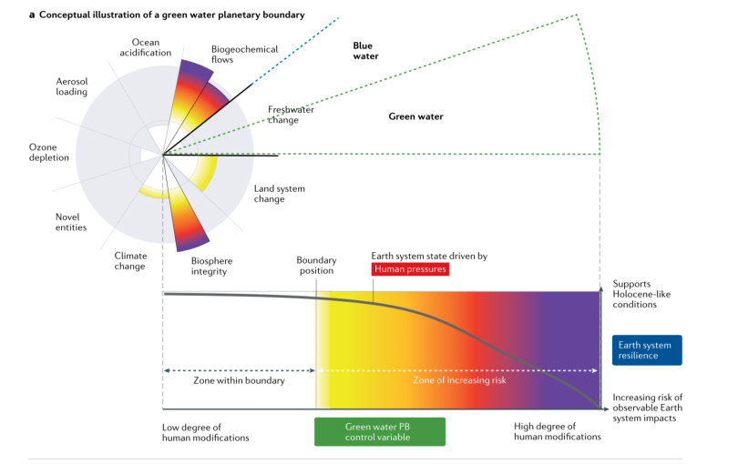
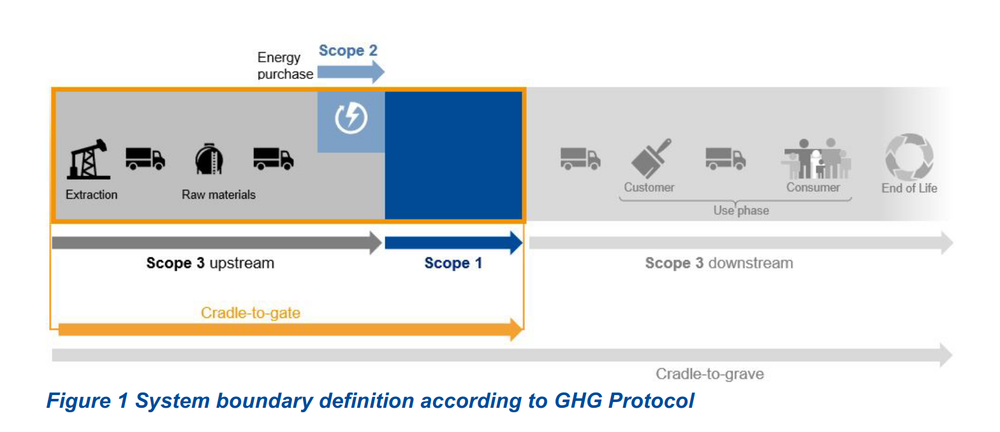
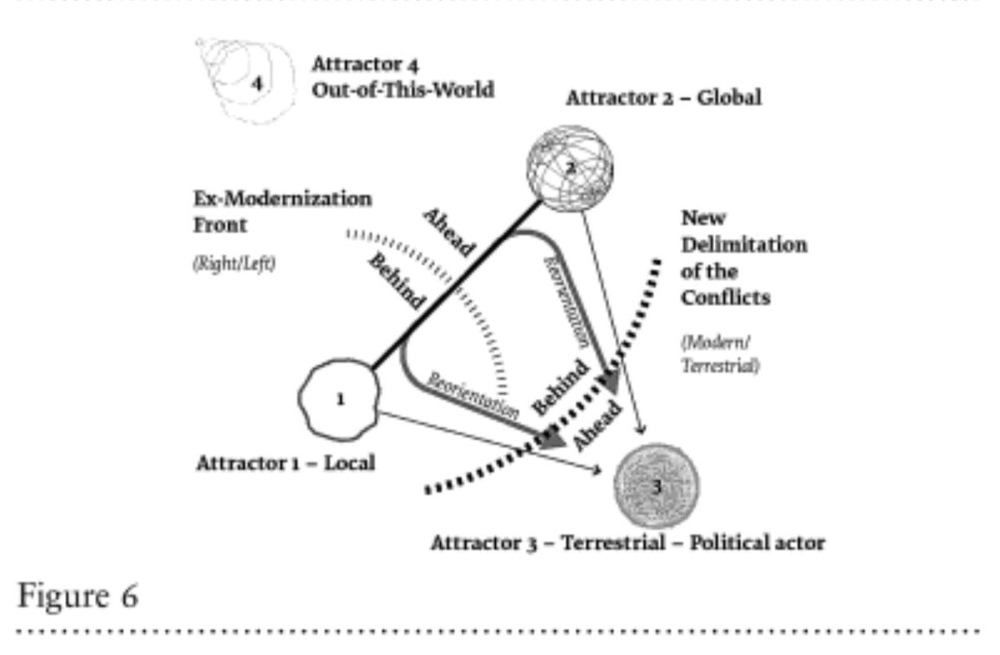

# Content Strategy and the Planetary Boundaries

# Economic growth and ecological breakdown

## The great acceleration

::: notes

The year 1950 is also often regarded as the key date for the beginning of a new geological age, namely the Anthropocene. The Anthropocene is therefore a geological age, at least that say those who want to introduce into the scientific geology, because in this age the man&mdash;one could also say: the mankind&mdash; is the decisive factor for the shape of the earth or the earth surface. Around 1950, a process begins which has been called the *Great Acceleration* in Earth system science. In the project of the same name, various indicators of growth processes were studied.

I'll start with a slide that belongs to a project called *The Great Acceleration* or *The Great Acceleration*. In this project , and you can see here that since about 1950, humanity's resource consumption and all the activities that lead to that resource consumption have increased gigantically and in some cases exponentially. 

:::

## The weight of the technosphere

Source: @zalasiewiczScaleDiversityPhysical2017a 

## The earth system and Earth System Science

> Humans have initiated global processes threatening the environment and living con­ditions of a large part of the world’s population, making entire regions of the Earth un­inhabitable, impairing global health and depleting natural resources to such an extent that the development of future generations is compromized. 

---

> Developing the scientific basis for an understanding of these processes and for risk assessments and solutions are the central challenges of the geosciences today. This requires an approach characterized by systemic thinking – the Earth System Science.

[@nationaleakademiederwissenschaftenleopoldinaZukunftsreportWissenschaftErdsystemwissenschaft2022, p.4]

## 

Source: @nationaleakademiederwissenschaftenleopoldinaZukunftsreportWissenschaftErdsystemwissenschaft2022, p.11

## 

Source: @nationaleakademiederwissenschaftenleopoldinaZukunftsreportWissenschaftErdsystemwissenschaft2022, p.17

## Planetary boundaries

 

Source: @nationaleakademiederwissenschaftenleopoldinaZukunftsreportWissenschaftErdsystemwissenschaft2022, after @steffenPlanetaryBoundariesGuiding2015
—

## Johan Rockström 2020

<iframe src="https://embed.ted.com/talks/lang/en/johan_rockstrom_10_years_to_transform_the_future_of_humanity_or_destabilize_the_planet" width="854" height="480" style="position:absolute;left:0;top:0;width:100%;height:100%" frameborder="0" scrolling="no" allowfullscreen></iframe>

@rockstrom10YearsTransform2020 

---

## {data-background="pics/tipping-points-infographic-carbon-brief.png"}

Source: @mcsweeneyExplainerNineTipping2020

---

## Hothouse earth?

::: notes

This great acceleration leads to the fact, and that then partly exactly the same scientists have investigated further, that different limits of the earth system have been exceeded. There are certain parameters which ensure that the earth is able to supply mankind at all. One often speaks in this connection of a so-called *safe operating space* for mankind. This includes, and this is especially in the foreground today in view of the climate strike, above all the right temperature. Humans are changing the climate through greenhouse gases, that is known to all, and thus humanity or the biosphere is threatening to leave this *safe operating space*. But there are also other planetary boundaries. A second very important one is biodiversity, but in connection with it also e.g. the input of phosphates and of nitrogen plays a big role. These are issues that are often not given much attention by the public. The working group that has been dealing with these planetary boundaries&mdash;all this belongs to the field of the so-called earth system sciences, which have developed since about 2000 or shortly before&mdash;today mostly speaks of nine planetary boundaries and several of them have already been crossed in a way that at least puts the survival of mankind, it can be said without exaggeration, in question and that will quite certainly lead to the fact that there will be millions or billions of victims.

:::

—

## 2022: Green water

@wang-erlandssonPlanetaryBoundaryGreen2022 

## 2022: Novel entities

@perssonOutsideSafeOperating2022 

## Planetary health&mdash;ecological grief

> The concept of planetary health is based on the understanding that human health and human civilisation depend on flourishing natural systems and the wise stewardship of those natural systems. However, natural systems are being degraded to an extent unprecedented in human history.

[Safeguarding human health in the Anthropocene epoch: report of The Rockefeller Foundation–Lancet Commission on planetary health](https://www.thelancet.com/journals/lancet/article/PIIS0140-6736\(15%2960901-1/fulltext "Safeguarding human health in the Anthropocene epoch: report of The Rockefeller Foundation–Lancet Commission on planetary health - The Lancet")

---

[Hope and mourning in the Anthropocene: Understanding ecological grief](https://theconversation.com/hope-and-mourning-in-the-anthropocene-understanding-ecological-grief-88630 "Hope and mourning in the Anthropocene: Understanding ecological grief")

[Climate change: 'We've created a civilisation hell bent on destroying itself – I'm terrified', writes Earth scientist](https://theconversation.com/climate-change-weve-created-a-civilisation-hell-bent-on-destroying-itself-im-terrified-writes-earth-scientist-113055 "Climate change: 'We've created a civilisation hell bent on destroying itself – I'm terrified', writes Earth scientist")

::: notes

Those who are involved in our usual economic processes and perhaps even feel comfortable in the functions for the growth economy in which we all live, may often not perceive how threatened we are simply as biological beings on earth. To many, the statements of a Greta Thunberg seem exaggerated or hysterical.

I must say of myself that only because I can occupy myself, so to speak, in the pension now purely temporally much more intensively with things like the planetary borders, many things do not seem to me suddenly any more natural, which I believed before, as so to speak liberal progress optimist, as natural. So I don't want to denounce the people who think differently than I present it here now. Very recently, I would have been one of them myself.

Nevertheless, many react to these processes with sorrow and grief. Something is asserting itself subliminally, and this was perhaps caused by the Corona crisis and the political developments afterwards, like *grief*, like depression. There is a dissatisfaction with everyday life in this enormously accelerated growth world, which is expressed, for example, in the fact that very very many were actually quite happy about the lockdown and experienced this time rather&mdash;as cynical as it sounds&mdash;than restful. This depression is perhaps often even more palpable in young people than in adults, but it makes up something like a basic cultural feeling. I believe that, especially in content strategy, we have to assume that the users we are addressing will increasingly have to deal with this basic mood, that they perceive the conditions under which they live as unhealthy and react to them. We are already noticing this at the marketing level in the way that sustainability is suddenly being emphasized and how things that might have been dismissed as eco-madness some time ago are suddenly being incorporated into the marketing strategy of large companies, which of course often then do everything other than actually operate sustainably. What I would like to say now in the following is also related to this basic feeling of sadness, of *grief*, of the idea that something is irrecoverably lost. These impressions are difficult to objectify, one could also dismiss them as illusions, but there is much to suggest that this feeling will become more and more prevalent and will replace the optimism about progress in which we have all been somehow caught up since the 80s and 90s.

:::

## Digitisation and resource consumption

https://www.sciencedirect.com/science/article/abs/pii/S0921800909002158?via%3Dihub "Growth in global materials use, GDP and population during the 20th century - ScienceDirect")

::: notes

What do we, as people working in the digital world in the broadest sense, have to do with this planetary boundary? It is clear, and it is probably actually trivial, that each and every one of us who works in a business enterprise or in connection with the economy, I for example at a so-called business-related university of applied sciences, is involved in some way in these processes that are part of the great acceleration: as a consumer privately and also in the area of our work and of course above all as a contributor to these growth processes. But we often do not really perceive this connection. We deal with content, with information. Thereby the whole material background does not become visible. In a certain way it is even systematically hidden, so that we have the impression that we are, so to speak, occupied with purely spiritual things and things that do not have any material effect. But this is a great illusion.

Almost everything we do also has material consequences. It starts, a very trivial connection, with the fact that we use electricity, and so much electricity that all the renewable energy on earth is not enough to produce just the electricity for the Internet right now. Some time ago, there was a report that just one tweet takes as much energy as a city drive in a small passenger car. So we are already not innocent by our working tools. The hardware, for example, a cell phone, a computer, also needs resources, and that&mdash;s something we might come to more often today&mdash;tremendously. But probably much more important is that what is then produced with it: Tourism, airplanes, food, things that are sold somewhere, fashion and so on, consumes resources, and in fact in exponential growth more and more resources, and that there is hardly any activity that is not related to this consumption of resources. Of course, this is especially true for any kind of marketing and content marketing, but it's also true if, for example, you're simply looking at how to better organize processes at an airport, or to come to an example from a content stratgy camp, if you're working for ADAC, because the car industry is one of the very biggest consumers of non-recoverable resources. We can't take ourselves out of it at all, and we are all involved, and especially at a UAS that is close to the economy, to a particularly intensive degree. I don't want to go into this involvement any further now because it is a separate topic, but it is a crucial and very important topic.

:::

## The illusion of decoupling

<!--
<iframe id="datawrapper-chart-USG70" style="width: 100%; border: none;" title="Material Footprint of Nations" src="https://datawrapper.dwcdn.net/USG70/3/" height="500" frameborder="0" scrolling="no" aria-label="chart"></iframe>
-->

 

[Andrew McAfee and the Myth of America's Green Growth](https://foreignpolicy.com/2020/06/18/more-from-less-green-growth-environment-gdp/ "Andrew McAfee and the Myth of America's Green Growth")

---

> The only unambiguous way we can use digital technologies for sustainability reasons is not by pursuing greater efficiency, but by enabling greater sufficiency in human action and degrowth in material consumption. How can the digital revolution be reconceptualised to serve a sufficiency revolution?

[Digitalization, Efficiency and the Rebound Effect](https://www.resilience.org/stories/2017-02-22/digitalization-efficiency-and-the-rebound-effect/ "Digitalization, Efficiency and the Rebound Effect - Resilience")

::: notes

In this context, it is now often argued that economic growth has so far been largely material, but that there is something like dematerialization, and that in the future the economy will grow on the basis of immaterial goods, which has nothing to do, so to speak, with the consumption of resources and the great acceleration described and the crossing of planetary boundaries. For what I am going to say now in the following, this is only partly relevant, because I am concerned with the content strategy in relation to our present, extremely resource-intensive economy. But I would like to point out that the idea that you can decouple growth from resource consumption is not in any way supported by data. In my opinion, it is an ideology designed to make people forget that our current economic system is not compatible with planetary limits in the long run or already. For the apparently immaterial services, with which we concern ourselves straight in the content strategy, nevertheless goods are consumed&mdash;often not with us&mdash;and the Dematerialisierung of the economic growth in the rich countries is connected with the fact that in the poor countries just more is produced. Those who lead a lifestyle in which they perhaps consume relatively few material goods, for example no longer have a car, then travel halfway around the world on vacation, buy luxury products that consume an insane amount of CO2, and afford a large apartment. The wealth that continues to grow, especially in the group of digital workers, will sooner or later always be converted into material products. There is no indicator that this process will stop in any foreseeable time.

:::

# Content strategy as a part of the growth economy

## Content as a key component of digital economy

[{width=100%}](https://de.slideshare.net/KarianneStinson/content-people-crave-smx-east-2014)

## Persuasive functions of content

[{width=100%}](https://www.slideshare.net/AthenaBrandWisdom/marketing-semiotics)

::: notes

Our particular responsibility arises from the fact that the content we work on is not just part of products, but that it has a persuasive function, i.e. it is intended to convince addressees of the quality of products or even brands.

To a significant extent, this persuasive quality of the content is tied to the fact that we refer to authorities, i.e., that we justify why the quality of the products is particularly good. These arguments usually ignore the negative aspects of the products, and in such cases we deliberately help to misinform the addressees. We then operate content strategy actually only as a marketing strategy for the suppliers.

One can distinguish at least two areas of this persuasion, whereby I do not want to go into the differences between content marketing, which is measured purely in terms of return of investment, and product- and user-oriented content strategy:

1. there are products that are directly linked to an unaccountable consumption of resources. This is true for all kinds of airplanes and services that depend on airplanes, it is true for cars with combustion engines and everything that is connected to them, it is true for large parts of the food industry, especially for all those that process meat, it is true for many, I assume also for most areas of tourism. It also goes for the construction industry, and and it goes for the large parts of the electronics industry, rely on products that are produced under inhumane conditions. With regard to these areas, it must actually be said that it is no longer possible for content strategists to work in them in an ethically responsible manner.
But there is also the whole area of products and services, which simply participate as components of the growth economy in the great acceleration of which I spoke at the beginning. Even if the products themselves may not have ecologically negative consequences, they are probably produced in an ecologically unjustifiable way or they contribute to the enrichment of people who then do ecologically unjustifiable things with the money they earn for it. Here we are dealing with what Extinction Rebellion calls the *toxic system*. Of course, many of the activities in the first area can be subordinated here as well, and it can be said that at the moment it is possible without ecologically negative cars, and that it is much more difficult to find jobs at all outside of these industries. So you can also make a justification here by orphaning on the whole system .

So we are actually dealing with two different ethical problems, but they are intertwined: 
- on the one hand, with the fact that one is involved in products that are directly harmful to the environment, but has hardly any alternatives to them,
- and on the other hand with the fact that one is integrated into a context, into a system, which has an extremely negative effect as a whole, as a growth economy, so to speak, and that responsible individual action is extremely difficult in this system. One cannot escape the problem which is connected with it. I also do not want to give a solution for it here. In the broadest sense, this is actually not just about the strategy behind certain communicative acts, but about their connection with quite comprehensive forms of life. for content strategists, it is perhaps more understandable to speak of the fact that we are not dealing with strategy here, but with culture.

:::

## Content as a cover for material flows

[{width=100%}](https://www.researchgate.net/publication/288823372_GSA_The_New_Sustainable_Frontier_Appendix-_2009/figures?lo=1)

[Environmental Justice Atlas](https://ejatlas.org/featured/climate-debt)

::: notes

This does not only mean that we do not spread opinions that have ethically unaccountable consequences. It also means that we share responsibility for the material consequences of what we do. We have to see, this is what matters to me today, that we are involved in a system or systems of material exchange that have disastrous consequences.

The dimension of our work that we tend to forget is that of the material flows, the material flows that are connected to this work. We are involved in such material flows as soon as we just press the button on a cell phone or computer, as soon as we consume something, and especially as far as we produce something that contributes to the sale of objects. In the time since the beginning of the Great Acceleration, these material flows have increased, plundering the planet's resources more and more, and at the same time, by the way, increasing the inequity in terms of opportunities to benefit from the planet's resources. 

The directly perceptible material flows concern the energy, which is consumed e.g. if we work with digital media with it recently e.g. Gerry McGovern intensively occupied. Many shrug their shoulders when this topic is mentioned. But this shrugging is a symbol for the ignorance of the material consequences of what we do. I bring a few examples from the areas, with which I had to do lately, partly also by climate activism. The airline industry has grown exponentially in recent years and, even more seriously, the growth of the airline industry in the coming years would, if it takes place as the industry wants, consume a quarter to a third of the CO2 that is still available worldwide under the Paris Agreement. The airline industry with it connected the tourism industry the international goods traffic runs so far unchecked further. It is planned a multiplicity of new airplanes of new airfields, countries will Turkey want to catch up. In spite of all the commitments to sustainability, one can see here that the concrete economic life is designed for growth and acceleration of growth.

Another example is the car traffic. Car traffic is responsible for most of the greenhouse gas emissions of the last decades, even if in the meantime it seems to have been overtaken by greenhouse gas emissions from livestock farming, especially cattle. Car traffic has also grown, and continues to grow regardless of all the assurances that it will be further ecologized.  I will mention only a few figures: the engines of diesel vehicles have become on average 40% more powerful in the last 20 years alone. One third of the cars that are registered in a country like Austria are SUVs, which means that the growth rate in the car industry is completely unrestrained.

Another example that I came across by chance, because we were looking for photos of urban situations for a small gallery that I am working on. It concerns the asphalt, which is created as well known also from a petroleum product namely bitumen with. In Austria alone, the queue of all the trucks that transport asphalt in a year would stretch from Vienna to Moscow if you put these vehicles one behind the other. Part of this waste is of course used for repairs, but a large part is also used for new buildings, for sealing, and thus for the further destruction of natural soil. Also here one sees growth namely growth of the building industry which is inevitably ecologically disastrous, by the way also, as many also still do not know by the fact that cement emits CO2 in large measure.

These two areas of transport and the construction industry alone show how much the economy is programmed for growth. This growth does not benefit everyone equally, but mainly the wealthy.

These material flows, which I have just mentioned, are often associated with great injustice - they run from the poor countries to the rich countries and, conversely, from the rich countries back to the poor countries. CO2 is only a one-sided example. The CO2 that we consume here burdens the ecology of the poor countries even more than our own ecology. There the people are already in existential crises, e.g. around Lake Chad or in East and West Africa.

:::

## Growth addiction in the discipline of content strategy 

* [User journeys should feel invisible | Shopify UX](https://ux.shopify.com/user-journeys-should-feel-invisible-293381711589 "User journeys should feel invisible | by Amelie Sirois | Sep, 2020 | Shopify UX")
* [Reimagining Your Omnichannel Content Strategy for Exponential Growth – CIDM](https://www.infomanagementcenter.com/product/reimagining-your-omnichannel/ "Reimagining Your Omnichannel Content Strategy for Exponential Growth – CIDM")
* [15 Examples of Brands With Brilliant Omni-Channel Experiences](https://blog.hubspot.com/service/omni-channel-experience "15 Examples of Brands With Brilliant Omni-Channel Experiences")
* [Das "FISH"-Modell und der "Content Radar" - Zwei Strategie Tools](https://scompler.com/rb-das-fish-modell-und-der-content-radar-zwei-strategie-tools-fuers-content-marketing-3/ "Das "FISH"-Modell und der "Content Radar" - Zwei Strategie Tools")

::: notes

for me the crucial question, and this is also the question I would like to discuss here today, is whether you can do content strategy at all without the horizon of growth. Personally, I assume that it is possible, and I would then also like to present some ways to do this in the last part of the talk, but I am not entirely sure and am very interested in other opinions.  From its origins, I assume that content strategy actually belongs to the often neoliberal called turbo-capitalist economy that has prevailed since the 1990s and that has replaced the older form of domesticated capitalism, which was nevertheless much more tied to the welfare state, at least in important areas. Content strategy uses content as a strategic asset and employs it in a more economically rational way than was previously the case. You could also say that it uses content strategy in the sense of digital design, whereas content was previously produced by hand, so to speak, or at most industrially. So it's very very difficult to even separate from the growth that large parts of the digitalized economy are associated with. Of course, this is true to a very special extent in areas like digital marketing, with which content strategy is at least closely associated. Here, as we all know, growth is particularly little questioned. But also in all then cases, it is simply because of the realities of our economic system, so to speak, that content strategy is usually justified at least as a contribution to more growth, and that it is usually closely related to marketing or to marketing opportunities. The importance of a company like shopify for content strategy shows how closely the disiplim is linked to marketing or marketing service companies. Add to that the fact that content is tied into marketing.machines anyway due to the supremacy of corporations like Alphabet and Meta. It's not so easy to imagine content that works differently, just as it's not so easy at all to imagine digital development and digital design that is not focused on growth and on ever increasing growth. In the area of software, Linux - or for me, certain forms of Linux - is a role model here, where people deliberately say that they won't simply replace old products without there being a compelling reason to do so.

Am I saying now that growth orientation is fundamentally problematic? Yes, that's exactly what I'm saying. The overstepping of planetary boundaries is a result of growth, and it will only be possible to slow it down successfully, or perhaps even to reverse it in part, if we succeed in making the economic system as a whole independent of growth and in many areas, and especially in the rich countries, in achieving an economy that consumes fewer material resources than the one we have today. Contributing to this growth is fundamentally problematic in my view.

:::

# Strategic dimension and ethics

## Strategy and tactics

> a practice can manifest a strategy or a way of life, a text can manifest a practice, as well as other higher levels, and a sign can ultimately manifest a whole way of life.

Jacques Fontanille, [Pratiques sémiotiques](https://www.cairn.info/pratiques-semiotiques--9782130569848.htm "Pratiques sémiotiques - Jacques Fontanille | Cairn.info")

---

> Ethics eludes calculation and replaces it with the meaning of a project. Ethics attributes actions to actors, and this attribution is all the more critical because it does not correspond to the "intention" of these actors.

Jacques Fontanille, [Pratiques sémiotiques](https://www.cairn.info/pratiques-semiotiques--9782130569848.htm "Pratiques sémiotiques - Jacques Fontanille | Cairn.info")

::: notes

Part of the strategic claim of content strategy is that the individual contents and their uses are integrated into contexts. That is precisely why content strategy exists. These contexts are determined by many players. If we take this seriously and, in the interest of the quality of the content, do not just focus on the sales interests of a company, then the ecological consequences of the products and economic activities in which the content is integrated are part of the strategic dimension of this content.

If we look at content from the users' point of view, then they have a claim to understand the products and services to which our content belongs. We have to satisfy this claim through the content.

In our content strategy, we generally assume that content is not just an add-on to a product or service, but an essential component. In fact, we often see the product as more of a part of the content that is associated with it. We see the content as what motivates to sell or benefit from a product. 

Therefore, the ethical dimension of a product or service is not easily separable from the content associated with that product or service. We sell the product through content, so to speak, and we always argue implicitly or explicitly that this product has ethical qualities. That applies to every form of brand communication, but ultimately to every form of strategic communication in general. You can think about this further and say that as soon as you leave the purely tactical level and get to the strategic level, you are not only dealing with the strategy of a seller, but also with the strategies of buyers or users, and that these strategies are related to ways of life, and thus to decisions about an ethical orientation. So dealing with how far we contribute to ecological crises with content, how far growth, be it overall or related to certain resources, is ethically justifiable or, as I'm trying to say now, not justifiable, is not just something like an arbitrary addition to the content we otherwise have to deal with, but it is part of our core business, even if this ethical dimension is often kept quiet or neutralized.

:::

## Content quality and media ethics

 

<https://www.seo-kueche.de/blog/der-seo-faktor-e-a-t-erklaert/>

## Professional ethics and responsibility

<blockquote class="twitter-tweet">
This is unfortunately no surprise. The general level of awareness is close to nonexistent. We&#39;ve simply never been informed in a way which puts the crisis in perspective. And this is the very heart of the problem. No change will be possible until media <a href="https://twitter.com/hashtag/FaceTheClimateEmergency?src=hash&amp;ref_src=twsrc%5Etfw">#FaceTheClimateEmergency</a> <a href="https://t.co/dXFpTovF7X">https://t.co/dXFpTovF7X</a>
&mdash; Greta Thunberg (@GretaThunberg) <a href="https://twitter.com/GretaThunberg/status/1308812842469150720?ref_src=twsrc%5Etfw">September 23, 2020</a></blockquote> 

---

> Good climate coverage eliminates the silos which confine climate coverage to the science desk and increases infrequency of reports as a regular part of every beat in every newsroom, especially weather, business, and politics.  

[About — Covering Climate Now](https://www.coveringclimatenow.org/about "About — Covering Climate Now")

::: notes

As content strategists, we also have responsibility for the content we communicate. As content strategists, we must be able to take responsibility for the content we help to publish.

Responsibility also stems from the fact that we are responsible for the quality of content and thus for the standards on the basis of which quality can be determined. Today, these standards must also include communicating the material consequences of the products to which our content belongs.

We cannot solve the dilemma by saying that we are responsible for services and not primarily for material products. Services are connected with material products and the consumption of resources.

:::

# Content for the doughnut

## Doughnut economics

 

## 

{width=50%}

---

<iframe width="560" height="315" src="https://www.youtube.com/embed/kxQeb2PDz9M" title="YouTube video player" frameborder="0" allow="accelerometer; autoplay; clipboard-write; encrypted-media; gyroscope; picture-in-picture; web-share" allowfullscreen></iframe>

## Local relevance vs. global market

[Reuse and Recycling - Fairphone](https://www.fairphone.com/de/impact/reuse-recycling/ "Reuse and Recycling - Fairphone")

::: notes

We can only justify content whose consequences we can assess. If I don't know what the products I use or sell can lead to, I have to say no in case of doubt or at least communicate this ignorance clearly. This also means that I communicate scientific findings, i.e. the findings of experts on the effects of products.

:::

## Networked communication vs. decontextualisation

{width=60%} @BASFMethodologyProduct2021

::: notes

I need to understand my content as connected to a variety of stakeholders, not ignoring some of them to satisfy others. No content can speak for everyone, but content can be connected to the others.

Decontextualization of content, products, and services is a major reason for not perceiving the environmental situation. To say that the consequences of a car, for example, are not our business is to actively participate in perpetuating the ecological disaster.

This decontextualization is particularly evident in the news&mdash;for those who still watch the news&mdash;when, for example, as was the case the other day, the first news story is that the richest one percent of the world's population is responsible for 50% of the emissions to date, then two news stories later there are reports about new subsidies for air travel in Germany, and then another two news stories later there are reports about protecting the mountains in the face of melting permafrost. If these news items were connected with each other&mdash;and these are now only the very conspicuous cross-connections&mdash;then many more people in the audience would notice how closely our everyday economic events, and how closely almost all the topics that one has to deal with in politics, are connected with the topics of climate, climate protection, planetary boundaries, biodiversity and so on. The fact that this connection is usually omitted is probably one of the main reasons why large parts of the population are still only very partially informed about the dimensions of the climate crisis and about its causes. I would just like to remind you of a tweet by Greta Thunberg, which shows that the very largest number of voters in Western countries do not know at all how many degrees of planetary warming are just bearable and how many are not.

For content associated with products, this means that this decontextualization helps to ignore the perhaps even often unintended side effects of products for ecology. Actually, my main interest in this talk or session is to suggest that we don't do this decontextualization, that we stop saying that whatever else is associated with a product or a service is not our business because it's beyond our horizon. By this I refer, on the one hand, to the content itself, where I think we should not be silent about what can be said about its ecological consequences, or even that we have an obligation to seek out content that educates us about those consequences. And I refer, on the other hand, to our duties as employees in companies or organizations, all of which also have responsibility for what ecology looks like on a small or large scale. We have a shared responsibility for what those organizations do, and thus for changing those organizations, through persuasion, through building coalitions within the company, and also through open rebellion, or, if I may say so, although I'm not at risk there myself, by simply leaving certain companies and industries. 

At the very beginning of my contact with content strategy I came across the beautiful formulation, at that time by Brigitte Radl: *Content strategists as agents of change*. I believe that this is true to an intensified degree today. We are no longer only responsible for the transformations associated with digitization and orientation to the needs of users, but we are responsible for redirecting the economy toward a state of compatibility with the future.

:::

## Scientific standards vs. self-authorisation

{width=60%}  

Advertising for sustainable poducts - @consumergoodsforumConsumerCommuniCationsGlossary2017
<https://www.gs1-germany.de/fileadmin/gs1/basis_informationen/LeitfadenNachhaltigeProduktaussagen.pdf>

::: notes

Neutral or objectve authorities must be responsible for the accountability of my content, to which I refer. Something like a scientific and ethical certification of the contents must be part of my quality criteria.

:::

## Regenerative products and services

{width=60%} 

@CircularEconomyPhiladelphia

::: notes

Only content that belongs to products and services that consume regenerable resources can be justified ethically.

Of course, this includes first and foremost all services, e.g. in the care and health sector, which are not designed to consume material resources at all and are therefore not scalable. Their status in a growth economy is precarious. A post-growth economy, however, will place particular value on precisely such services, and in the case of these services, content strategy and digital communication would actually reduce resource consumption if it were not pursued with the perspective of continuously increasing the profit that can also be made in these areas. If content is used to simply distribute government services more efficiently and cheaply, for example, then it essentially still contributes to the growth economy. But if it simply takes the place of costly material services, it has an ecologically useful function.

:::

## Regenerative content

* [World Wide Waste - Gerry McGovern](https://gerrymcgovern.com/worldwidewaste/ "World Wide Waste - Gerry McGovern")
* [LOW←TECH MAGAZINE](https://solar.lowtechmagazine.com/ "LOW←TECH MAGAZINE")

::: notes

The content itself must consume only the absolutely necessary and, in turn, regenerative resources for its communication. This means that they consume as little energy as possible, that they are not addictive, and that users control the relationship with the organization that publishes the content.

:::

# Content industry and rebellion

## Agents of transformation

::: notes

Am I trying to promote some kind of holistic view of life here, where somehow everything is connected to everything else and thereby subjected to a certain moral standard? For me it's about the opposite, about local, responsible and controllable content. I'm not about a pre-industrial relationship to content, but about the responsible post-industrial use of content in local contexts controlled by different stakeholders.

:::

## Content and form of life

 

[Bruno Latour: Down to earth](http://www.bruno-latour.fr/node/754.html)

::: notes

:::
