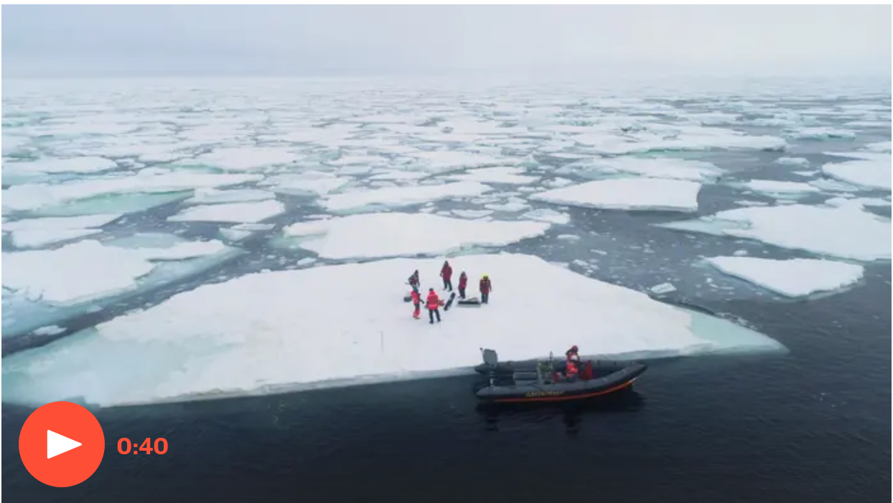

---
title: Contentstrategie für das Postwachstum
keywords: #LecturesForFuture
author: Heinz Wittenbrink
date: 2019-06-14

---

# Klima und CO2

## Keeling curve

[The Keeling Curve | A daily record of atmospheric carbon dioxide from Scripps Institution of Oceanography at UC San Diego](https://scripps.ucsd.edu/programs/keelingcurve/)

## {data-background-image="pics/ipcc1.png" data-background-size="contain"}

https://www.ipcc.ch/site/assets/uploads/2018/02/AR5_SYR_FINAL_SPM.pdf

# Konsequenzen des Klimawandels

## {data-background-image="pics/guardian_oceans.png" data-background-size="contain"}

[Our oceans broke heat records in 2018 and the consequences are catastrophic | Climate change | The Guardian](https://www.theguardian.com/environment/climate-consensus-97-per-cent/2019/jan/16/our-oceans-broke-heat-records-in-2018-and-the-consequences-are-catastrophic)

## "The end of the arctic as we know it"

[The end of the Arctic as we know it | Environment | The Guardian](https://www.theguardian.com/environment/2019/jun/07/oceans-demise-the-end-of-the-arctic-as-we-know-it)

## {data-background-image="pics/guardian_india.png" data-background-size="contain"}

[Indian villages lie empty as drought forces thousands to flee | World news | The Guardian](https://www.theguardian.com/world/2019/jun/12/indian-villages-lie-empty-as-drought-forces-thousands-to-flee "Indian villages lie empty as drought forces thousands to flee | World news | The Guardian")

# CO2 Budget

##

> Der Weltklimarat gibt das CO2-Budget in seinem 2018er Sonderbericht mit 420 Gt an, wenn das 1,5-Grad-Ziel (bezüglich der globalen Luftdurchschnittstemperatur an der Oberfläche) mit 66 % erreicht werden soll. Bei gleichbleibendem Ausstoß wäre dieses Budget in neun bis zehn Jahren aufgebraucht.[9][10]

[CO2-Budget – Wikipedia](https://de.m.wikipedia.org/wiki/CO2-Budget)

# Wir produzieren durch unseren Lebensstil CO2

##

##

> Vor allem der Energiesektor mit stationären und mobilen Quellen emittiert in Deutschland Treibhausgase, besonders Kohlendioxid. Relevant sind aber auch die Emissionen der Industrieprozesse und der Landwirtschaft, letztere insbesondere durch die Freisetzung von Methan und Lachgas.

[Emissionsquellen | Umweltbundesamt](https://www.umweltbundesamt.de/themen/klima-energie/treibhausgas-emissionen/emissionsquellen#textpart-1)

##

##

> Das Klimaziel, Deutschlands Emissionen bis 2020 um 40 Prozent gegenüber 1990 zu senken, bleibt trotz der ausgesprochen guten 2018er-Bilanz unerreichbar.

[CO₂-Emissionen fallen wie seit Jahren nicht – klimareporter](https://www.klimareporter.de/deutschland/co2-emissionen-fallen-wie-seit-jahren-nicht)

# Wirtschaftswachstum ohne CO2-Emissionen?

## {data-background-image="pics/is_green_growth_possible.png" data-background-size="contain"}

[Is Green Growth Possible?](https://www.tandfonline.com/doi/full/10.1080/13563467.2019.1598964 "Is Green Growth Possible?: New Political Economy: Vol 0, No 0")

##

> There is one empirical model that feasibly accomplishes emissions reductions consistent with the Paris Agreement, without relying on negative emissions technologies.

##

> The scenario, known as ‘Low Energy Demand’ (LED), accomplishes emissions reductions compatible with 1.5°C by reducing global energy demand by 40 per cent by 2050.

> key feature of this scenario is that global material production and consumption declines significantly

##

> Dematerialisation is accomplished by shifting away from private ownership of key commodities (like cars) towards sharing-based models. LED differentiates between the global North and South. Industrial activity declines by 42 per cent in the North and 12 per cent in the South. With efficiency improvements, this translates into industrial energy demand declining by 57 per cent in the North and 23 per cent in the South.

##

> while absolute decoupling of GDP from emissions is possible and is already happening in some regions, it is unlikely to happen fast enough to respect the carbon budgets for 1.5°C and 2°C against a background of continued economic growth.

# Folgen für die Content-Strategie

## Content-Strategie für Nachhaltigkeit vs. Content-Strategie für Verkauf

- Reduktion des Verbrauchs
- Unterstützung von Vernetzung
- Verzicht auf Marketing-Plattformen

## Content Strategie für ökologische Transparenz

- Ökologischer Fußabdruck aller Produkte und Services
- Ökologische Mission der Organisation

## Content-Strategie für Daten und Wissenschaft

- Verfügbarmachen von Daten
- Barrierefreiheit von Argumentationen

<!--

# Content-Strategie für userorientiertes Campaigning

- User-Tasks statt Botschaften
- Orientierung an Services
- Personen-Orientierung

## Die klimakrise bekommen wir nur in den Griff, wenn der materielle Konsum deutlich sinkt

# Imperiale Lebensweise

##

---

Wenn wir zum weiteren Wachstum beitragen tragen wir zur Verschärfung der Klimakrise bei

Es hat das mit Content Strategie zu tun?

Content Strategie muss sich wie andere Design Disziplinen auf eine Postwachstums-Ökonomie einstellen.

##

Jede Organisation wird beweisen müssen, dass sie ein Teil der Lösung und nicht des Problems ist. Dazu gehört eine komplette ökologische Transparen

 der Organisation, der Produkte und der Services.

## Content for Science

Das kann man als Erweiterung der Forderung nach progressive enhancement verstehen.

Offener vernetzter Content als einer intelligenten ressourcenschonenden Wirtschaft

Contentstrategie ist nicht für eine Postwachstums-Ökonomie entwickelt worden, aber die Fokussierung auf den Content betont Aspekte, die nicht mit Ressourcen Verbrauch verbinden sind

# Beispiel

##

Wie sorgen wir dafür, das unsere Inhalte so gut wie möglich wieder verwendbar sind?

---

http://www.materialflows.net/ -->
