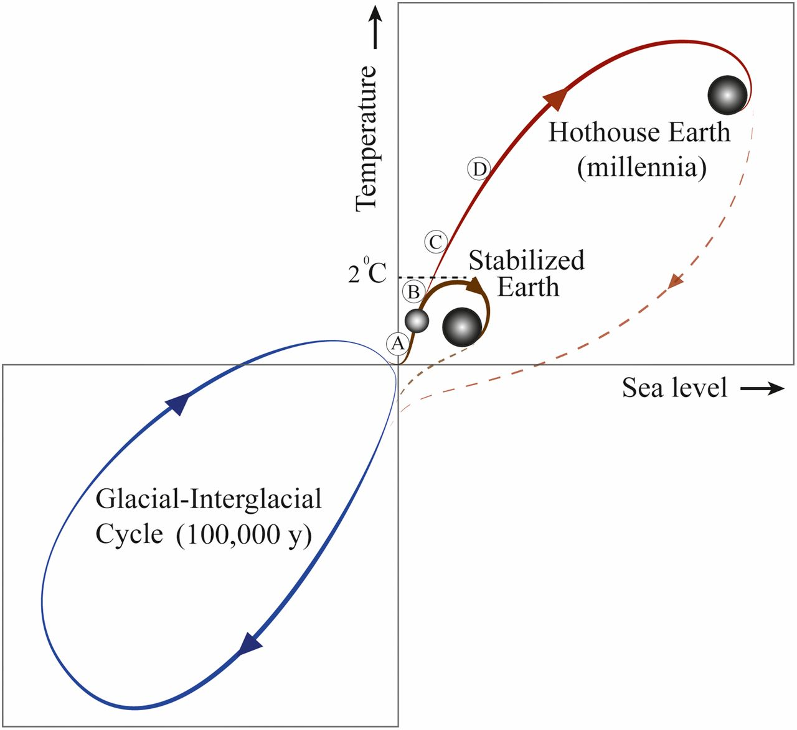

---
title: Content Strategy for Degrowth
keywords: #LecturesForFuture
author: Heinz Wittenbrink
date: 2019-10-19
bibliography: contentstrategy4degrowth.bib

---

## Creatives for climate

<iframe width="1129" height="630" src="https://www.youtube.com/embed/ZsLJEfS4Yms" frameborder="0" allow="accelerometer; autoplay; encrypted-media; gyroscope; picture-in-picture" allowfullscreen></iframe>

# Climate and CO2

## Keeling curve

[The Keeling Curve | A daily record of atmospheric carbon dioxide from Scripps Institution of Oceanography at UC San Diego](https://scripps.ucsd.edu/programs/keelingcurve/)

## {data-background-image="pics/ipcc1.png" data-background-size="contain"}

<https://www.ipcc.ch/site/assets/uploads/2018/02/AR5_SYR_FINAL_SPM.pdf>

## {data-background-image="pics/scientific_assessment_1979.png" data-background-size="contain"}

<https://www.bnl.gov/envsci/schwartz/charney_report1979.pdf>

# Leaving the holocene

## {data-background="pics/greatacceleration2015igbpsrc_june2015lowres-1024x714.jpg" data-background-size="contain"}

##

<https://www.unternehmensgruen.org/wp-content/uploads/2016/11/PlanetareGrenzen_Gerten_PIK.pdf>

##

Steffen, W., Broadgate, W., Deutsch, L., Gaffney, O., & Ludwig, C. (2015). The trajectory of the Anthropocene: The Great Acceleration. The Anthropocene Review, 2(1), 81–98. https://doi.org/10.1177/2053019614564785

# Consequences of global heating

## {data-background-image="pics/guardian_oceans.png" data-background-size="contain"}

[Our oceans broke heat records in 2018 and the consequences are catastrophic | Climate change | The Guardian](https://www.theguardian.com/environment/climate-consensus-97-per-cent/2019/jan/16/our-oceans-broke-heat-records-in-2018-and-the-consequences-are-catastrophic)

## "The end of the arctic as we know it"

[The end of the Arctic as we know it | Environment | The Guardian](https://www.theguardian.com/environment/2019/jun/07/oceans-demise-the-end-of-the-arctic-as-we-know-it)

## {data-background-image="pics/guardian_india.png" data-background-size="contain"}

[Indian villages lie empty as drought forces thousands to flee | World news | The Guardian](https://www.theguardian.com/world/2019/jun/12/indian-villages-lie-empty-as-drought-forces-thousands-to-flee "Indian villages lie empty as drought forces thousands to flee | World news | The Guardian")

# CO2 budgets

##

> In its 2018 Special Report, the Intergovernmental Panel on Climate Change estimates the CO2 budget at 420 Gt if the 1.5 degree target (in terms of global average surface air temperature) of 66 % is to be achieved. If emissions remained the same, this budget would be used up in nine to ten years.[9][10]

[CO2-Budget – Wikipedia](https://de.m.wikipedia.org/wiki/CO2-Budget)

##

> According to the authors of A good life for all within planetary boundaries, if we divided the amount of carbon that we can still burn equally between everyone on earth, then each person could emit 1.6 tonnes of CO2 equivalent per year until 2100. That would give us a 66% chance of staying beneath 2°C of warming, generally accepted as a threshold for dangerous climate change.

##

> However, if you use the latest figures (as of 2018) for human population and remaining carbon budget, that falls to 1.2 tonnes of CO2 equivalent per person per year.

> That’s less than a one-way economy flight from London to San Francisco.

[What should be a person's average carbon footprint per year if we want to reduce and stop global warming? - Quora](https://www.quora.com/What-should-be-a-persons-average-carbon-footprint-per-year-if-we-want-to-reduce-and-stop-global-warming "What should be a person's average carbon footprint per year if we want to reduce and stop global warming? - Quora")

<!--

##

[{width=e0%}](https://www.theguardian.com/environment/datablog/2017/jan/19/carbon-countdown-clock-how-much-of-the-worlds-carbon-budget-have-we-spent "Carbon countdown clock: how much of the world's carbon budget have we spent? | Environment | The Guardian")

[Carbon countdown clock: how much of the world's carbon budget have we spent? | Environment | The Guardian](https://www.theguardian.com/environment/datablog/2017/jan/19/carbon-countdown-clock-how-much-of-the-worlds-carbon-budget-have-we-spent "Carbon countdown clock: how much of the world's carbon budget have we spent? | Environment | The Guardian") -->

##

<iframe src="https://interactive.guim.co.uk/embed/aus/2017/carbon-embed" width="100%" height="500px" frameborder="0" scrolling="no"></iframe> 
Source: Nick Evershed, <a href="https://www.theguardian.com/environment/datablog/2017/jan/19/carbon-countdown-clock-how-much-of-the-worlds-carbon-budget-have-we-spent">Carbon countdown clock: how much of the world&#8217;s carbon budget have we spent?</a> <em>The Guardian</em>, January 19, 2017.

# Our lifestyle is toxic

## "Imperial lifestyle" ([Ulrich Brand](https://www.oekom.de/buch/imperiale-lebensweise-9783865818430 "Imperiale Lebensweise | oekom verlag GmbH"))

[World's richest 10% produce half of global carbon emissions, says Oxfam | Environment | The Guardian](https://www.theguardian.com/environment/2015/dec/02/worlds-richest-10-produce-half-of-global-carbon-emissions-says-oxfam "World's richest 10% produce half of global carbon emissions, says Oxfam | Environment | The Guardian")

##

##

> In particular, the energy sector with stationary and mobile sources emits greenhouse gases in Germany, especially carbon dioxide. However, emissions from industrial processes and agriculture are also relevant, the latter in particular due to the release of methane and nitrous oxide.

[Emissionsquellen | Umweltbundesamt](https://www.umweltbundesamt.de/themen/klima-energie/treibhausgas-emissionen/emissionsquellen#textpart-1)

##

##

> The climate target of reducing Germany's emissions by 40 percent by 2020 compared to 1990 remains unattainable, especially due to the release of methane and nitrous oxide, despite the extremely good 2018 balance.

[CO₂-Emissionen fallen wie seit Jahren nicht – klimareporter](https://www.klimareporter.de/deutschland/co2-emissionen-fallen-wie-seit-jahren-nicht)

## {data-background-image="pics/klimaschutzbericht_2018.png" data-background-size="contain"}

<https://www.umweltbundesamt.at/fileadmin/site/publikationen/REP0660.pdf>

##

> For this, however, a far-reaching change in society and economy is necessary... In particular, the focus should be on investments in those long-lived infrastructures and sustainable technologies that make it possible to phase out the use of fossil energy ...

[Klimaschutzbericht 2018 – Zusammenfassung Umweltbundesamt Wien 2018](https://www.umweltbundesamt.at/fileadmin/site/publikationen/REP0660.pdf)

# Economic growth without CO2 emissions?

## {data-background-image="pics/is_green_growth_possible.png" data-background-size="contain"}

[Is Green Growth Possible?](https://www.tandfonline.com/doi/full/10.1080/13563467.2019.1598964 "Is Green Growth Possible?: New Political Economy: Vol 0, No 0")

##

> There is one empirical model that feasibly accomplishes emissions reductions consistent with the Paris Agreement, without relying on negative emissions technologies.

##

> The scenario, known as ‘Low Energy Demand’ (LED), accomplishes emissions reductions compatible with 1.5°C by reducing global energy demand by 40 per cent by 2050.

> key feature of this scenario is that global material production and consumption declines significantly

##

> Dematerialisation is accomplished by shifting away from private ownership of key commodities (like cars) towards sharing-based models. LED differentiates between the global North and South. Industrial activity declines by 42 per cent in the North and 12 per cent in the South. With efficiency improvements, this translates into industrial energy demand declining by 57 per cent in the North and 23 per cent in the South.

##

> while absolute decoupling of GDP from emissions is possible and is already happening in some regions, it is unlikely to happen fast enough to respect the carbon budgets for 1.5°C and 2°C against a background of continued economic growth.

# Consequences for content strategy

##

- Content strategy has always been part of the growth economy
- We understand content strategy better when we no longer require growth
- "Content first" as a motto of a dematerialised economy
- Accessibility and progressive enhancement as guiding principles

## Content Strategy for Sustainability vs. Content Strategy for Sales

- Reduction of consumption
- Support for networking
- No need for marketing platforms

##

> "But if you ask what is the kind of economy we want at this point, particularly in the developed economies, it makes sense to expand in the services that improve our lives, like health, education, social care, recreation, culture and crafts.

[Rio+20: Tim Jackson on how fear led world leaders to betray green economy | Guardian Sustainable Business | The Guardian](https://www.theguardian.com/sustainable-business/rio-20-tim-jackson-leaders-green-economy "Rio+20: Tim Jackson on how fear led world leaders to betray green economy | Guardian Sustainable Business | The Guardian")

## Content strategy for ecological transparency

- Ecological footprint of all products and services
- Ecological mission of the organization

## Content strategy for data and science

- Making data available
- Accessibility of argumentations

## Content strategy for user-oriented campaigning

- User tasks instead of messages
- Orientation towards services
- Orientation towards personalizied communication (Greta, XR)

##

Translated from German with some help by <https://www.DeepL.com/Translator>

# End Matter

##

##

Github repository for this presentation:

[heinzwittenbrink/slides-contentstrategy4degrowth: What can content strategy do for an economy which respects planetary boundaries?](https://github.com/heinzwittenbrink/slides-contentstrategy4degrowth "heinzwittenbrink/slides-contentstrategy4degrowth: What can content strategy do for an economy which respects planetary boundaries?")

<!--

## Die klimakrise bekommen wir nur in den Griff, wenn der materielle Konsum deutlich sinkt

# Imperiale Lebensweise

##

---

Wenn wir zum weiteren Wachstum beitragen tragen wir zur Verschärfung der Klimakrise bei

Es hat das mit Content Strategie zu tun?

Content Strategie muss sich wie andere Design Disziplinen auf eine Postwachstums-Ökonomie einstellen.

##

Jede Organisation wird beweisen müssen, dass sie ein Teil der Lösung und nicht des Problems ist. Dazu gehört eine komplette ökologische Transparen

 der Organisation, der Produkte und der Services.

## Content for Science

Das kann man als Erweiterung der Forderung nach progressive enhancement verstehen.

Offener vernetzter Content als einer intelligenten ressourcenschonenden Wirtschaft

Contentstrategie ist nicht für eine Postwachstums-Ökonomie entwickelt worden, aber die Fokussierung auf den Content betont Aspekte, die nicht mit Ressourcen Verbrauch verbinden sind

# Beispiel

##

Wie sorgen wir dafür, das unsere Inhalte so gut wie möglich wieder verwendbar sind?

---

http://www.materialflows.net/ -->
